# Java基础笔记

# Day1

# java发展史

-   **1995   SUN公司发布了Java**
-   ...
-   2005  JDK1.5正式更名为了JDK5.0
-   **2006  正式开源，走向伟大**
-   2009  Oracle收购了Sun公司
-   2011 JDK7.0
-   2014  JDK8.0

## Java的优势

1.  简单
2.  跨平台
3.  开源
4.  纯面向对象

## 配置

1.  安装JDK
    -   不要安装1.8之前的版本
    -   尽量不要更改安装路径
2.  配置环境变量
    -   JAVA\_HOME：jdk的安装路径(截止至bin目录之前)
        -   告诉计算机JDK的位置
    -   Path：%JAVA\_HOME%\bin
        -   告诉计算机Java自带的命令所在的位置
    -   CLASSPATH：.   （类路径）
        -   .表示的是当前文件路径之下
        -   JDK5.0之后无须再次配置
3.  名词解释
    -   JDK：Java的工具包
        -   JRE+类库+调试工具+编译器
    -   JRE：Java的运行环境
        -   JVM+解释器
    -   JVM：Java虚拟机
        -   用来运行Java代码。可以屏蔽底层操作系统之间的差异，为跨平台提供支持

## Java的运行机制

源代码-->编译器-->将源代码编译成字节码文件(.class)(平台通用文件)-->解释器-->逐行解释逐行执行

> 先编译，后解释执行

## 第一个Java程序

> 目标：输出hello world

1.  新建Java文件，后缀名为.java
2.  编码：
    -   class：类
        -   是盛放代码的容器
        -   程序的基本组成单元
    -   类名：区分每个类
    -   {}：划分类的边界
    -   主函数：程序的入口
        -   写在类的内部
        -   写法固定
        -   一个类至多存在一个
        -   内容在主函数中从上到下、从左至右依次执行
    -   输出语句：用来输出某个内容
        -   写法固定
        -   加ln：
            -   输出内容会换行
            -   可以输出空
        -   不加ln：
            -   输出内容不会换行
            -   不能输出空
3.  执行
    -   编译：javac  源文件名.java
        -   每个类都会生成一个对应的字节码文件
        -   字节码文件名与对应类名保持一致
    -   解释执行：java  类名
        -   真正执行的是相同名字的字节码文件

```java
clsclass Hello1{
  public static void main(String[] args){
    System.out.println("helloworld!");
    System.out.println("helloworld!");
    System.out.println();
    //System.out.print(); 错误！
    System.out.print("helloworld!");
    System.out.print("helloworld!");
  }
} 
```

## 黑窗口的常见命令

| 命令       | 作用        |
| -------- | --------- |
| 盘符名:     | 进入指定盘符    |
| cd  文件夹名 | 进入指定文件夹   |
| cd  ..   | 退出当前文件夹   |
| cd  \\   | 返回上个层级    |
| dir      | 查看当前路径子目录 |
| cls      | 清屏        |

## public-公开类

```java
public class 类名{
   
}
```

-   类名必须与源文件名保持一致
-   一个源文件至多存在一个公开类

## package-包

### 作用

整理归纳字节码文件

```java
package 包名.包名.包名...;
如：
   package com.bz.day1;
```

### 使用

1.  位置：必须写在有效代码第一行（注释不属于有效语句）
2.  一个.表示一个层级(层级之间是嵌套关系)
    > 作业包名命名要求：com.名字缩写.第三层级.其他层级
    > 包名命名不要低于三层
3.  一个源文件至多存在一个
4.  如果文件中声明了package，则必须**带包编译**，否则package声明无效
    ```java
    编译：javac -d . 源文件名.java
    解释执行：java 包名.类名
    ```

## 编码规范

### 硬性规范

1.  严格遵守大小写
2.  命名不能以数字开头
3.  符号只接收\_和\$  (空格也属于符号)
4.  命名不能使用关键字和保留字

### 软性规范

> 不遵守并不会报错，但是从职业操守来看必须遵守

1.  不以汉字命名
2.  类名命名采用大驼峰命名法：所有首字母大写（如：StudentClass）
3.  变量、函数采用小驼峰命名法：从第二部分开始首字母大写（如：studentAge）
4.  包名命名全小写
5.  常量命名全大写（如：NUMBER），多个部分之间使用\_连接（如：STUDENT\_NUMBER）
6.  一定做到望名知意

## 注释

### 特点

不参与代码的编译和运行。作用为对代码添加备注说明

### 单行注释

```java
//这是单行注释
```

-   一次注释一行内容

### 多行注释

```java
/*
这是多行注释
*/
```

-   一次注释多行内容

### 文档注释

```java
/**
这是文档注释
*/
```

-   作用：对某个方法或某个类进行备注说明，可以结合指定编译语句生成说明文档

#### 使用

1.  只有公开类可以生成说明文档
2.  生成说明文档的编译命令：
    ```java
    javadoc -d . 源文件名.java
    ```
3.  只能为类和方法(函数)生成文档

# Day2-变量和运算符

> 什么是程序？
> 利用逻辑操作数据
> ​	操作数据：增删改查、**存储**

## 变量的概念

变量是计算机内存中的一块存储空间。是存储数据的基本单元

## 变量的组成

> 酒店					计算机内存
> 房间					变量
> 房间类型			数据类型
> 房间号				变量名
> 住人					作用：存储数据

-   变量的组成：数据类型、变量名、数据

## 变量的创建

1.  先声明，再赋值
    ```java
    数据类型 变量名;
    变量名=值;
    ```
    ```java
    int age;//声明
    age=18;//赋值
    ```
    -   变量必须在赋值之后才可使用
2.  声明的同时直接赋值（常用）
    ```java
    数据类型 变量名=值;
    ```
    ```java
    int age2=20;
    ```
3.  同时声明多个变量，之后再一一赋值
    ```java
    数据类型 变量名1,变量名2,变量名3,...;
    变量名1=值;
    变量名2=值;
    ...
    ```
    ```java
    //同时声明多个
        int age3,age4,age5;
        //一一赋值
        age3=21;
        age4=22;
        age5=23;
    ```
    -   多个变量的数据类型必定一致
4.  同时声明多个变量并直接赋值
    ```java
    数据类型 变量名1=值1,变量名2=值2,...;
    ```
    ```java
    int age6=24,age7=25,age8=30;
    ```

## 数据类型

Java是一个强类型的语言，意味着每个数据都有其对应的数据类型

### 划分

-   基本数据类型（八大基本类型）
    -   整数：byte、short、int、long
    -   小数：float、double
    -   字符：char
    -   布尔：boolean
-   引用数据类型
    -   只要不属于八大基本类型，就一定属于引用类型（如String）

#### 整数

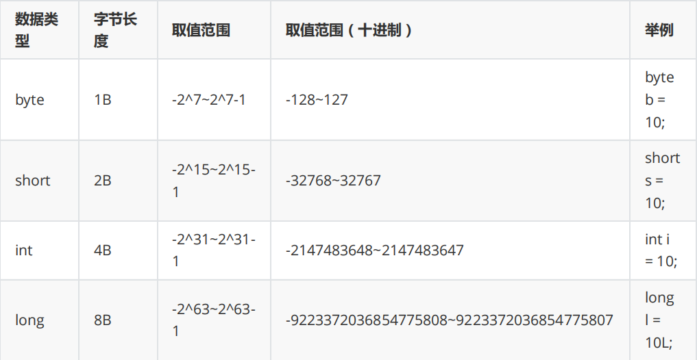

-   long类型数据末尾需要添加L或者l long类型数据末尾需要添加L或者l **（在取值超出了int的范围时）****（在取值超出了int的范围时）**
-   **int是整型的默认类型**（一个整数没有声明数据类型时默认为int类型）

#### 小数类型(浮点)

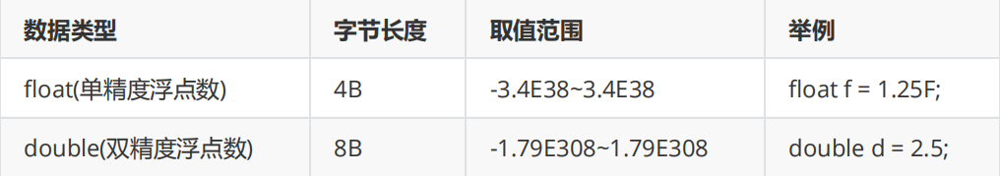

-   float赋值时**必须添加**F或者f
-   **double是小数的默认类型**

#### 布尔类型

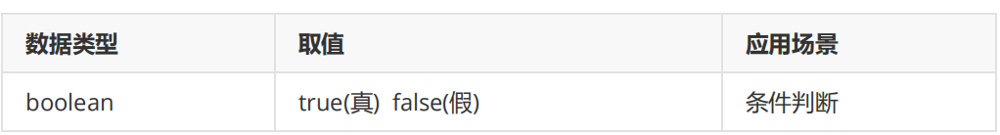

-   八大基本类型中唯一一个不能参与数学运算的

#### 字符类型

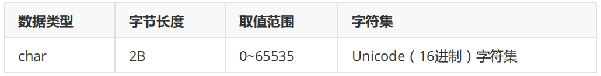

```java
第一种：char 变量名='值';
第二种：char 变量名=整数值; （必须在取值范围内）
第三种：利用16进制的Unicode编码赋值（不常用，了解）
```

```java
//单引号赋值
    char c1='A';
    //整数赋值
    char c2=65;//A
    //Unicode编码赋值
    char c3='\u0041';//A
```

-   单引号赋值：只能存放一个字符元素
-   整数赋值|编码赋值：会将对应的字符内容赋值给变量

> A-Z: 65-90
> a-z: 97-122

#### String-引用类型

-   字符串

```java
String 变量名="值";
```

-   只要写进双引号的内容都是字符串
-   对内容不做任何要求
-   值必须写进双引号

## 类型转换

-   基本类型之间相互赋值传递的是值

### 自动类型转换

-   将小类型的值赋值给大类型，不会出现数据溢出，可以直接完成转换

```java
大类型=小类型;
```

#### 类型排序

-   从小到大：

byte-->char-->short-->int-->long-->float-->double

-   boolean不参与类型转换

### 强制类型转换

-   将大类型赋值给小类型，有可能出现数据溢出，导致数据损失，所以需要强转

```java
小类型=(小类型)大类型;
```

1.  大类型的值在小类型的取值范围内，不会出现数据损失
    ```java
    int a=10;
    byte b=(byte)a;//10
    ```
2.  大类型的值不在小类型的取值范围内，会出现数据溢出，导致数据不准确
    ```java
    int a=200;
    byte b=(byte)a;//-56
    ```
3.  将小数赋值给整数，会直接舍弃小数位
    ```java
    double d=5.9;
    int n=(int)d;//5
    ```

#### 与String

-   任意类型加上双引号或者拼接双引号都会变成String类型

```java
System.out.println(5+6+"a");//11a
System.out.println(5+"a"+6);//5a6
System.out.println("a"+5+6);//a56
```

## 自动类型提升

-   只发生在数学运算时
-   概念：当数学运算中有大类型参与时，结果会被自动提升为大类型

## 转义字符

-   作用：将有特殊功能的字符转成普通字符使用

```java
\特殊字符
   如：System.out.println("\"");
```

-   特殊转义字符：（必须写在双引号中）
    -   \n
        -   换行
    -   \t
        -   代表一段制表符距离

## 表达式

通过运算符将两个及以上的变量或者值连接起来，最终可以得到一个结果，该连接起来的式子称之为表达式

## 运算符

### 算数运算符

+、-、 \*、/、%+、-、 \*、/、%

```java
int a=10;
int b=3;
System.out.println(a/b);//3
System.out.println(a%b);//1
```

### 赋值运算符

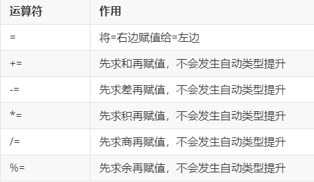

-   如有需要，会自动完成类型强转
    ```java
    int a=10;
        //a=a+1.5;  //会发生自动类型提升，提升为double
        
        a+=1.5;//a=a+1.5;
        
        System.out.println(a);//11
    ```

### 一元运算符

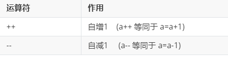

#### ++和--在前

```java
如：
   ++a
   --a
```

-   先运算，再赋值（表达式整体的结果是加减之后的值）

```java
    int a=1;
    int b = ++a;//int b=表达式的结果;   表达式的结果!=a的结果
    
    System.out.println("a:"+a);//2
    System.out.println("b:"+b);//2
```

#### ++和--在后

```java
如：
   a++
   a--
```

-   先赋值，再运算（表达式的结果是加减之前的值）

```java
    int a=1;
    int b = a++;//int b=表达式的结果;   表达式的结果!=a的结果
    
    System.out.println("a:"+a);//2
    System.out.println("b:"+b);//1
```

> a的值一定会改变
> b的值要根据表达式的结果决定

### 比较运算符

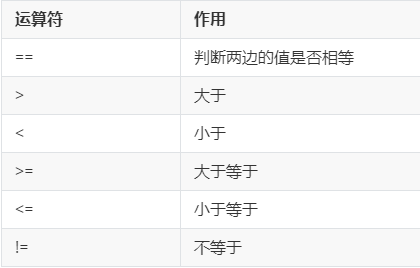

-   结果是boolean类型

### 逻辑运算符

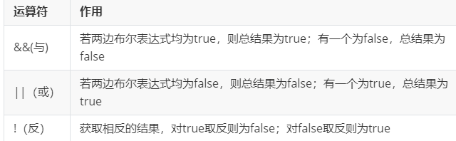

> 逻辑与(&&)：多个表达式结果都为true，最终结果才为true（都为真，才为真）
> 逻辑或(||)：多个表达式有一个为true，最终的结果就是true，都为false，结果才是false（有一个为真，则为真）
> 逻辑非(!)：取表达式结果的相反值

-   结果为boolean类型

```java
    System.out.println((1==1)&&(2>1));//t
    System.out.println((1!=1)&&(2>1));//f
    System.out.println((1!=1)||(2>1));//t 
    System.out.println((1!=1)||(2<1));//f
    System.out.println(!(2>1));//f
```

> &&和||：短路运算符  常用
> ​	**短路机制**：执行到可以决定最终执行结果的表达式时，就会终止后续表达式的判断
> &和|：非短路运算符
> ​	不具备短路机制，所有表达式一定会进行运算

```java
    System.out.println((1>2) && (5/0==0));//f
    System.out.println((1==1) || (5/0==0));//t
    
    System.out.println((1>2) & (5/0==0));//运行报错
    System.out.println((1==1) | (5/0==0));//运行报错
```

### 三元运算符


-   ?和:后边也可以是表达式

```java
    int a=1;
    int b=   a>1 ? 10 : 20;//true执行?,false执行:
    System.out.println("b:"+b);//20
    int c=  a==1?a++:++a;
    System.out.println("c:"+c);//1
```

## 今日重点

1.  八大基本类型及其所占字节(boolean记忆字面值)
2.  什么是自动类型提升？
3.  强制类型转换的发生时机及语法
4.  ++在前和在后的区别
5.  什么是短路机制？

# Day3-分支

-   选择分支结构

## if分支

```java
if(布尔表达式){
   //逻辑代码
}
```

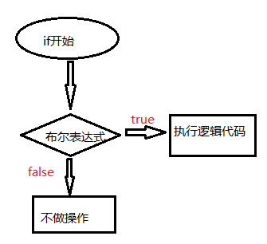

```java
int score=79;//成绩
    //如果成绩>=80,则奖励一辆兰博基尼，如果不>=80,则不做任何操作
    if(score>=80){
      System.out.println("奖励一辆兰博基尼");
    }
```

## if else分支

```java
if(布尔表达式){
   //if中的逻辑代码
}else{
   //else中的逻辑代码
}
```

!\[]\(test.assets/if else.png)

```java
int score=90;//成绩
    //如果成绩>=80,则奖励一辆兰博基尼，如果不>=80,则送去孤儿院
    if(score>=80){
      System.out.println("奖励一辆兰博基尼");
    }else{
      System.out.println("送去孤儿院");
    }
```

-   if else只能执行其中一个
    > if else分支和三元运算符可以互等
    1.  如果逻辑没有嵌套并且逻辑代码极其简单，推荐使用三元运算符
    2.  其他情况，推荐使用if else分支(使用频率更高)
    ```java
    ////如果成绩>=80,则奖励一辆兰博基尼，如果不>=80,则送去孤儿院
    System.out.println(   score>=80?"奖励一辆兰博基尼":"送去孤儿院"  );
        
        //如果成绩>=80,则奖励兰博基尼，
        //如果成绩没有>=80,如果成绩>=60,送去养猪
        //如果成绩没有>=60,则送去孤儿院
        if(score>=80){
          System.out.println("奖励一辆兰博基尼");
        }else{//成绩<80
          if(score>=60){
            System.out.println("送去养猪");
          }else{//成绩<60
            System.out.println("送去孤儿院");
          }
        }
    ```

## 多重if else分支

```java
if(布尔表达式1){
   //逻辑代码1
}else if(布尔表达式2){
   //逻辑代码2
}else if(布尔表达式3){
   //逻辑代码3
}else{
   //else中的逻辑代码
}
```

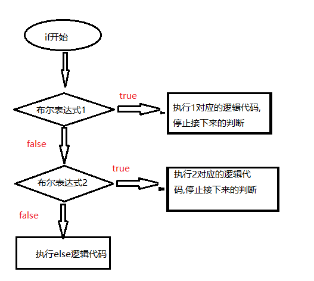

```java
int score=30;//成绩
    
    //判断成绩，成绩>=80  输出兰博基尼
    //如果成绩>=60,输出迈凯伦
    //如果成绩>=50,输出五菱宏光mini
    //如果成绩<50,送去孤儿院
    if(score>=80){
      System.out.println("兰博基尼");
    }else if(score>=60){
      System.out.println("迈凯伦");
    }else if(score>=50){
      System.out.println("五菱宏光mini");
    }else{
      System.out.println("送去孤儿院");
    }
```

-   一个多重if分支是一个整体，至多执行一个分支内容
-   比较顺序为从上往下
-   只要逻辑完整，多重if分支的条数不做要求
-   else可以省略，如果存在，必须写在最下方

## 嵌套if分支

```java
if(外层布尔表达式){
   if(内层布尔表达式){
      //内层if逻辑代码
   }else{
      //内层else逻辑代码
   }
}else{
   //外层else的逻辑代码
}
```

-   内层分支结构可以嵌套进外层分支结构的任一大括号中
-   只要逻辑完整，对于嵌套层数不做要求
-   判断流程：从外至内

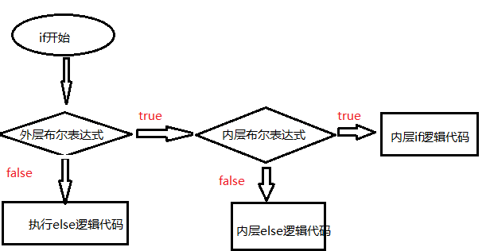

## switch分支

-   作用：用来对固定值进行判断，从而进行分支选择

```java
switch(变量名|拥有具体值结果的表达式){
   case 值1:
      //逻辑代码1
      break;
   case 值2:
      //逻辑代码2
      break;
   default:
      //逻辑代码
}
```

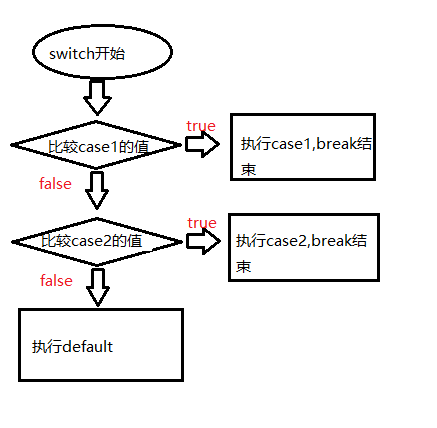

### 使用

1.  从上往下判断case
2.  可以使用switch实现的操作多重if分支一定可以，但是反之则不一定(switch无法判断区间)
3.  当某个case满足条件时，剩余case将不再继续判断
4.  break的作用为强制跳出分支，结束当前分支的执行
5.  多个case可以共用同一个逻辑代码
    ```java
    //判断月份，输出对应的天数(除去2月)
        int month=4;//代表月份
        switch(month){
          case 1:
          case 3:
          case 5:
          case 7:
          case 8:
          case 10:
          case 12: //if(month==1 || month==3 || month==5...)
            System.out.println("31天");
            break;//强制跳出分支，结束当前分支的执行
          case 4://if(month==4)
            System.out.println("30天");
            break;
          default://else
            System.out.println("我不知道");
        }
    ```
6.  default对于位置没有特殊要求，但是一定最后判断
    -   未写在最下方时，必须添加break防止继续向下执行case
        ```java
        switch(month){
              default://else
                System.out.println("我不知道");
                break;
              case 1:
              case 3:
              case 5:
              case 7:
              case 8:
              case 10:
              case 12: //if(month==1 || month==3 || month==5...)
                System.out.println("31天");
                break;//强制跳出分支，结束当前分支的执行
              case 4://if(month==4)
                System.out.println("30天");
                break;
              
            }
            
        ```
7.  **swtich中只能接收比较byte、short、char、int、String(JDK7.0之后)**

## Scanner扫描器

-   是Java类库中一个可以接收用户键入数据的工具类

### 语法

```java
//创建扫描器
java.util.Scanner sc=new java.util.Scanner(System.in);
//接收用户输入：
  1. 接收String：sc.next()
   2. 接收int：sc.nextInt();
   3. 接收double：sc.nextDouble()
   4. 其他基本类型同理:sc.nextXxx();
   5. 接收char：sc.next().charAt(0)
```

```java
//让用户输入自己的姓名、年龄、成绩，接收并打印输出
    //1. 创建扫描器
    java.util.Scanner sc=new java.util.Scanner(System.in);
    //2. 给用户提示
    System.out.println("请输入你的姓名：");
    //3. 接收用户输入
    String name=sc.next();
    System.out.println("请输入你的年龄：");
    int age=sc.nextInt();
    System.out.println("请输入你的成绩：");
    double score=sc.nextDouble();
    
    System.out.println("姓名为："+name+",年龄为："+age+",成绩为："+score);
```

## import-导包

-   作用：在当前源文件中一次性引入某个或者某些类

```java
import 包名.类名;
如：
   import java.util.Scanner;
```

### 使用

1.  位置：写在源文件第一个类的上方，package语句的下方
2.  可以存在多个import导包语句
3.  可以通过\*一次性引入某个包下的所有类
    ```java
    如：import java.util.*;//引入java.util包下所有的类
    ```
4.  \*只能导入直属的类，无法导入子包中的类
5.  通配符\*在一个导包语句中至多出现1次
    ```java
    import java.util.*.*;//错误！
    ```
6.  必须截止至类，不可截止至包
    ```java
    import java.util;//错误！
    ```
7.  每个源文件中都默认导入了java.lang. \*;2每个源文件中都默认导入了java.lang. \*;2

## 今日重点

1.  if分支系列的使用
2.  switch都能接收什么数据类型
3.  Scanner扫描器的使用

# Day4-循环

## 局部变量

### 概念

定义在函数/方法内部的变量

### 特点

1.  作用范围：从定义行开始，到直属代码块大括号结束
2.  命名冲突：在同一作用范围内，变量不可重名

## 循环结构

### 概念

在满足某个条件的前提下，重复执行同一个逻辑代码

### while循环

```java
while(布尔表达式也称为循环条件){
   //逻辑代码（也成为操作语句、循环体）
}
```

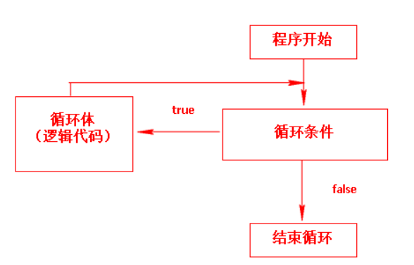

```java
//让陈君泽在操场上跑5圈
    
    int i=1;//循环初始值，代表圈数
    while(i<=5){//循环条件
      //操作语句：陈君泽跑圈
      System.out.println("陈君泽正在跑第"+i+"圈");
      i++;//迭代语句：圈数+1，准备跑下一圈
    }
```

#### 循环完整组成条件

循环初始值、循环条件、操作语句、迭代语句(对初始值进行有规律的变化)

> 不是所有循环都必须完整拥有以上四部分，循环初始值和迭代语句可以看情况省略

#### while的执行流程

初始值-->判断循环条件-->为true-->操作语句-->迭代语句-->判断循环条件-->直到为false-->循环结束

-   初始值只会执行一次

#### while的执行特点

先判断、再执行（只有当满足循环条件时，才会执行操作语句）

> 一些案例：

```java
//利用while循环求1-100的和
    //1+2+3+4+5+6+7+8+9+...+100
    
    int i=1;//初始值:定义在循环上方
    int sum=0;//累加器，接收和：定义在循环上方
    while(i<=100){//循环条件
      sum+=i;//操作语句：循环内部
      i++;//迭代：循环内部，操作语句下方
    }
    
    System.out.println("1-100的和为："+sum);
```

```java
//求1-100之间偶数的和
    //2 4 6 8 10 12 14 16 18...100
    
    int sum=0;//累加器：求和初始值为0，求乘积初始值为1
    
    /* int i=1;//初始值，写在循环上方
    while(i<=100){
      if(i%2==0){//判断是否是偶数
        sum+=i;//0+2+4
      }
      i++;//迭代
    }  */
    
    int i=2;//初始值
    while(i<=100){
      sum+=i;
      i+=2;//以偶数的规律进行变化
    }
    
    
    System.out.println(sum);
```

### 流程控制

#### break

跳出当前所有循环，使当前循环停止

```java
//先假设小张一直走，在走的过程中判断其是否走到1800，是则结束循环
    int dept=0;//步数
    while(true){
      if(dept*1.5>=1800){//循环内部最上方
        break;//结束循环
      }
      dept++;//如果未走到，则步数+1继续前进
    }
    
    System.out.println(dept);
```

> 死循环：循环永远满足循环条件，所以循环体将一直不断执行，该现象称之为死循环

#### continue

跳出本次循环，直接开始下一次循环

```java
//1-100之内的逢7过：7的倍数、个位是7、十位是7都需要跳过 
    int i=1;//初始值
    while(i<=100){
      if(i%7==0 || i%10==7 || i/10==7){
        i++;//防止其无法继续向下执行
        continue;//直接开始判断下一个数字，本次数字不再向下输出
      }
      System.out.println(i);//正常输出
      i++;
    }
```

#### 区别

1.  break是跳出所有循环，continue是跳出本次循环
2.  break可以作用于switch分支，但是continue不行

### do-while循环

```java
do{
   //操作语句
}while(循环条件);
```

#### 执行特点

先执行，再判断（无论如何都会执行一次操作语句，然后才会进行循环条件的判断）

```java
import java.util.Scanner;
public class Day4_3{
  public static void main(String[] args){
    //让陈君泽跑圈，每跑完一圈为其打分，分数>=80结束跑圈，否则继续跑
    //已知：循环结束的条件、最起码需要先执行一次，才能得到分数进行判断
    Scanner sc=new Scanner(System.in);
    
    int score=0;//提升score变量的作用范围，保证while中可以判断
    do{
      System.out.println("陈君泽正在跑圈...");
      System.out.println("跑步结束，请为其打分：");
      score=sc.nextInt();//接收用户分数
      
    }while(score<80);
    
    
  }
  
}
```

#### 执行流程

操作语句-->判断循环条件-->为true-->操作语句-->判断循环条件-->直到为false-->循环结束

```java
//其他案例：
Scanner sc=new Scanner(System.in);
    //实现一个提示系统，让用户输入一个整数,判断输出其奇偶性，输出-1退出结束循环
    int n=0;//用来接收用户输入
    //第一种实现方式
    do{
      System.out.println("请输入一个整数：");
      n=sc.nextInt();
      if(n>=0){
        if(n%2==0){
          System.out.println("偶数");
        }else{
          System.out.println("奇数");
        }
      }
      
    }while(n!=-1);
    
    
    //第二种实现方式    
    do{
      System.out.println("请输入一个整数：");
      n=sc.nextInt();
      if(n==-1){//判断是否需要跳出结束循环
        break;
      }
      if(n%2==0){
        System.out.println("偶数");
      }else{
        System.out.println("奇数");
      }
    }while(true);
```

### for循环

```java
for(循环初始值;循环条件;迭代语句){
   //操作语句
}
```

```java
for(int i=1;i<=5;i++){
  System.out.println("陈君泽正在跑第"+i+"圈");
}
```

#### 使用

1.  while循环的操作和for循环可以互等
2.  for循环的执行流程：

-   初始值-->循环条件-->为true-->操作语句-->迭代-->循环条件-->直到为false-->循环结束

1.  对比while：
    -   循环次数不确定时推荐使用while
    -   循环次数确实时推荐使用for
2.  for循环小括号内部三部分都可省略，但是;不可省
    ```java
    for(;;){
       
    }
    等价于：
       while(true){
          
       }
    ```

### 嵌套循环

#### 概念

在一层循环中再次定义循环

#### 使用

1.  **执行特点：外层循环执行一次，内层循环执行一遍**
2.  外层循环代表行，内层循环代表列（图形输出）

```java
//利用*输出一个长为7宽为3的长方形
    /* 
    *******
    *******
    *******
     */
     
     for(int i=1;i<=3;i++){//代表行
       for(int j=1;j<=7;j++){//代表列
         System.out.print("*");
       }
       //一行内容执行结束，换行
       System.out.println();
     }
```

> 执行流程：i=1 --> j从1遍历到7  -->换行  -->i++变成2  -->j从1遍历到7  -->i++变成3  -->j从1遍历到7  -->i++变成4  -->不符合循环条件，循环结束

```java
一些案例：
   //当每行的列数不统一时，找行与列之间的关系
    /* 
    
    *         i=1-1
    ***       i=2-3
    *****     i=3-5
    
    行与列之间的关系为：j=i*2-1
    
     */
    
    for(int i=1;i<=3;i++){//代表行
      for(int j=1;j<=i*2-1;j++){//代表列
        System.out.print("*");
      }
      System.out.println();
    }
    /* 
    
    *      1-1
    **     2-2
    ***    3-3 
    ****   4-4
    *****  5-5
     */
    for(int i=1;i<=5;i++){//代表行
      for(int j=1;j<=i;j++){//代表列
        System.out.print("*");
      }
      System.out.println();
    } 
    /* 
    
        *
      * * *
     * * * * *
     总共3行
     i=1  空格：2   *：1
     i=2  空格：1   *：3
     i=3  空格：0   *：5
     
     空格和i的关系：空格=总行数-i
     *和i的关系：i*2-1
     
      */
    for(int i=1;i<=3;i++){//行
      //先输出空格、
      for(int m=1;m<=3-i;m++){
        System.out.print(" ");
      }
      //再输出*号
      for(int k=1;k<=i*2-1;k++){
        System.out.print("*");
      }
      //换行
      System.out.println();
    }
```

1.  break和continue只能作用于自身直属的循环层次
2.  只要逻辑完整，对嵌套层数不做要求，通常不会超过两层

## 今日重点

1.  局部变量的特点
2.  while和do-while的区别（各自的执行特点）
3.  break和continue的区别
4.  嵌套循环的执行特点

# Day5-函数

## 概念

是对重复功能代码的提取，一个函数代表一个功能，其特点为可以重复使用

> 作用：

1.  解决功能与功能间的代码冗余
2.  将类中的内容按照功能划分清晰

## 语法

```java
访问修饰符 返回值类型 函数名(形参列表){
   //操作语句
}
```

```java
public static void 函数名(){
   //操作语句
}
```

## 位置

写在类的内部，其他函数的外部，与主函数平级

## 调用

函数想要执行，必须在主函数中进行调用

```java
函数名(实参列表)
函数名()
```

### 位置

想要在哪执行，就在哪调用

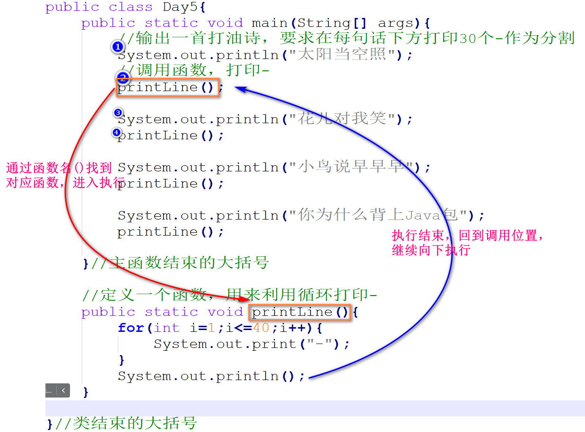

-   执行流程：进行函数调用时，只有当函数中内容执行结束回到调用位置，程序才会继续向下执行

## 参数

-   当函数中存在不确定因素时，该因素应该被定义为参数

### 一个参数

```java
public static void 函数名(数据类型 形参名){

}
调用：函数名(具体值);
```

#### 形参

形式上的参数。特点为没有具体值，只有声明部分，写在函数定义的小括号中

#### 实参

实际上的参数。特点为是一个具体值或者拥有具体值结果的表达式，写在函数调用的小括号中

#### 使用

1.  必须为形参传入对应实参
2.  实参的作用就是给形参赋值
3.  执行流程：


    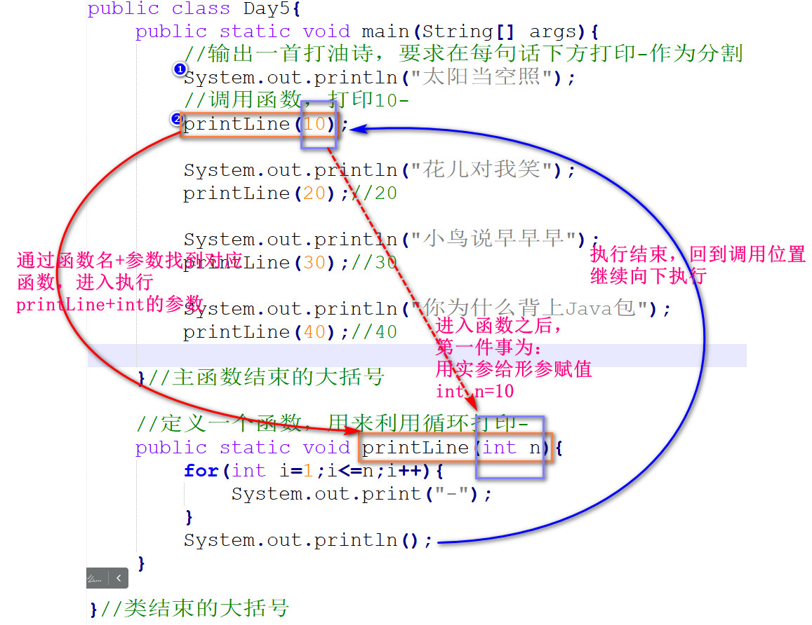

### 多个参数

```java
public static void 函数名(数据类型 形参名1,数据类型 形参名2,..){

}
调用：函数名(具体值1,具体值2,..);
```

#### 使用

1.  多个参数时，实参与形参的**参数列表**必须保持一致
    -   参数列表：数据类型、个数、顺序

```java
public class Day5{
  public static void main(String[] args){
    //输出一首打油诗，要求在每句话下方打印-作为分割
    System.out.println("太阳当空照");
    //调用函数，打印10-
    printLine(10,"-");
    
    System.out.println("花儿对我笑");
    printLine(20,"*");//20*
    
    System.out.println("小鸟说早早早");
    printLine(30,"+");//30+
    
    System.out.println("你为什么背上Java包");
    printLine(40,"#");//40#
    
  }//主函数结束的大括号
  
  //定义一个函数，用来利用循环打印-
  public static void printLine(int n,String str){
    for(int i=1;i<=n;i++){
      System.out.print(str);
    }
    System.out.println();
  }
  
}//类结束的大括号
```

## 返回值

-   函数的执行结果

```java
public static 返回值类型 函数名(形参列表){
   //操作语句
   return 值;
}
```

-   当函数没有返回值时返回值类型部分为void，有返回值是为具体的数据类型

### return

-   用来**向上返回**返回值结果
    -   向上：向调用者返回

#### 使用

1.  当函数定义返回值类型时，则必须通过return关键字传递返回值
2.  执行流程：


    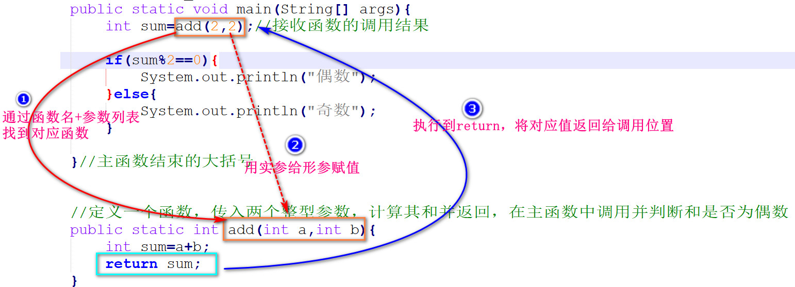
3.  当函数中存在分支时，则必须保证每种分支情况都存在对应的return语句执行
    ```java
    //定义一个函数，传入整型参数n，判断并返回n是否为偶数
      public static boolean method(int n){
        if(n%2==0){
          return true;//是偶数，返回true
        }else{
          return false;
        }
      }
    ```
4.  一个函数最多执行一个return语句
5.  当函数调用有返回值时，调用者必须处理返回值，否则函数的返回值将没有意义
    -   处理方式：
        1.  定义变量接收，之后操作变量，变量的数据类型必须与函数声明保持一致
        2.  直接操作返回值
        ```java
        //第一种处理方式：更推荐
            boolean boo=method(6);//定义变量接收
            System.out.println(  boo?"偶数":"奇数"  );//操作变量
            
            //第二种方式，直接操作返回值
            System.out.println(  method(6)?"偶数":"奇数"  );
        ```
6.  有返回值时的万能处理思路：
    1.  在函数最上方定义用来返回的变量，并设置初始值（变量类型必须与函数声明返回值保持一致）
    2.  在操作语句中更改变量的值
    3.  在函数的最下方return该变量
    ```java
    public static boolean isZhi2(int n){//9
        //第一步：在函数最上方定义用来返回的变量，并设置初始值
        boolean boo=true;
        for(int i=2;i<n;i++){
          if(n%i==0){
            //第二步：在操作语句中更改变量的值
            boo=false;//有其他因子，不是质数
          }
        }
        
        //第三步：在函数的最下方return该变量
        return boo;
      }
    ```

> return知识点扩展补充：
> 作用1：向上返回返回值
> 作用2：强制结束程序的执行
> ​			**return;**
> 注意：return下方同一直属作用范围内不允许存在其他有效语句

## 函数高级

### 函数的嵌套调用

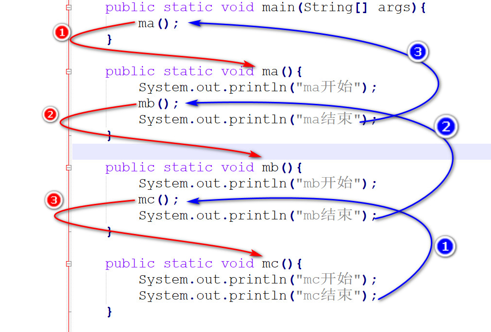

#### 使用

1.  只要逻辑完整，对于嵌套层数不做要求
2.  嵌套调用时执行顺序与结束顺序刚好相反

### JVM内存结构（了解）

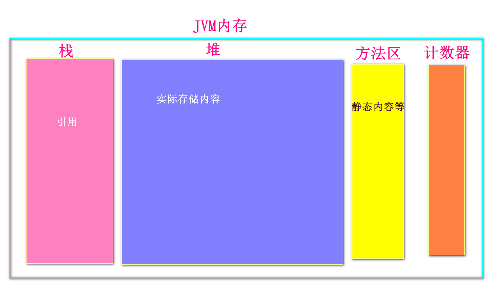

> JDK8.0之后，方法区被归纳到了堆之中

1.  栈的特点：只能操作栈顶元素。存往顶部存，取从顶部取
    -   先入后出（FILO）
2.  栈帧：是栈的基本组成元素
    -   每调用一次函数，都会生成一条栈帧，栈帧中包含函数的所有的信息，如局部变量、返回值等

## 递归

-   自己调用自己
    > 注意：能用递归实现的内容都可以使用循环代替
    > 目前大家还未拥有足够丰富的编码经验，所以递归的写法无需完全掌握

### 使用

1.  递归必须在函数上方存在最终向上返回的条件，否则将陷入无限递归。
    -   当无限递归过程中生成的栈帧将栈的内存撑爆，则程序终止

```java
//求某个数字的阶乘
  public static int getNum(int n){
    if(n==1){//当n=1时，向上返回：1是最小的阶乘值
      return 1;
    }
    return n*getNum(n-1);
  }
  /* 
  //假设n=5
  5*4*3*2*1
    -->4*3*2*1
      -->3*2*1
        -->2*1
  
  5的阶乘：5*4*3*2*1  -->5*4的阶乘
  4的阶乘：4*3*2*1    -->4*3的阶乘
  3的阶乘：3*2*1     -->3*2的阶乘
  2的阶乘：2*1       -->2*1的阶乘
  1的阶乘：1
  
  
  n的阶乘=n*(n-1)的阶乘
  
   */
```

## 今日重点

1.  函数的完整语法
2.  形参和实参的区别
3.  什么是参数列表？
4.  return关键字的使用

# Day6-数组

> 变量操作同一组的多个数据存在的问题：

1.  书写繁琐，命名麻烦
2.  当多个数据是同一组数据时，变量无法以组操作，操作效率过慢

## 概念

是一块连续的存储空间，用来存储多个相同数据类型的值

## 创建

1.  先声明，后指明长度
    ```java
    数据类型[] 数组名;//声明
    数组名=new 数据类型[长度];//指明长度
    ```
    ```java
    //先声明
        int[] arr;
        //后指明长度
        arr=new int[5];
    ```
    -   创建的时候必须指明长度
        -   指明长度的原因是为了方便内存分配空间
2.  声明的同时直接指明长度（常用）
    ```java
    数据类型[] 数组名=new 数据类型[长度];
    ```
    ```java
    int[] arr2=new int[3];
    ```
    -   前后数据类型必须保持一致
    -   长度的声明必须为整型
3.  创建的同时直接赋值
    ```java
    数据类型[] 数组名=new 数据类型[]{值1,值2,值3,...};
    ```
    ```java
    int[] arr3=new int[]{18,20,30,60}; 
    ```
    -   数组长度由大括号内值的个数决定
    -   中括号内不可再次指明长度
4.  创建的同时直接赋值（常用）
    ```java
    数据类型[] 数组名={值1,值2,...};
    ```
    ```java
    int[] arr4={20,30,40,66,88};
    ```
    -   不可先声明，后直接赋值
        ```java
        int[] arr5;//先声明
        arr5={10,2,3};//再直接赋值   错误！
        ```

## 下标

-   通过下标锁定数组中的每个元素位置
-   下标从0开始，到数组长度前一位结束
-   使用：
    -   取值：数组名\[下标]
    -   赋值：数组名\[下标]=值;
-   下标的使用不可超出范围，否则会报下标越界异常
    -   java.lang.IndexOutOfBoundsException

## 遍历

-   依次获取数组元素的过程称之为数组遍历
-   遍历数组的过程实际上就是下标变化的过程
-   可以通过**数组名.length**可以动态获取数组长度

```java
for(int i=0;i<数组名.length;i++){//i代表下标
  //可以通过数组名[i]获取数组当前遍历的元素
}
```

```java
for(int i=0;i<arr2.length;i++){//i代表下标
  System.out.println(arr2[i]);
}
```

-   数组如果只创建未赋值，则存放的为当前数据类型的默认值
    -   默认值的作用为进行占位，使内存能够正常的为数组分配空间
    > int : 0
    > double : 0.0
    > String : null
    > char : 空
    > boolean : false

## 数组高级

### 深入数组底层

-   **属于引用类型**
-   **栈中存放数组引用名**，引用名中存放着该数组对应的堆空间中首元素的地址，**堆中存放着数组数据**
    
    > 程序员-->栈-->堆

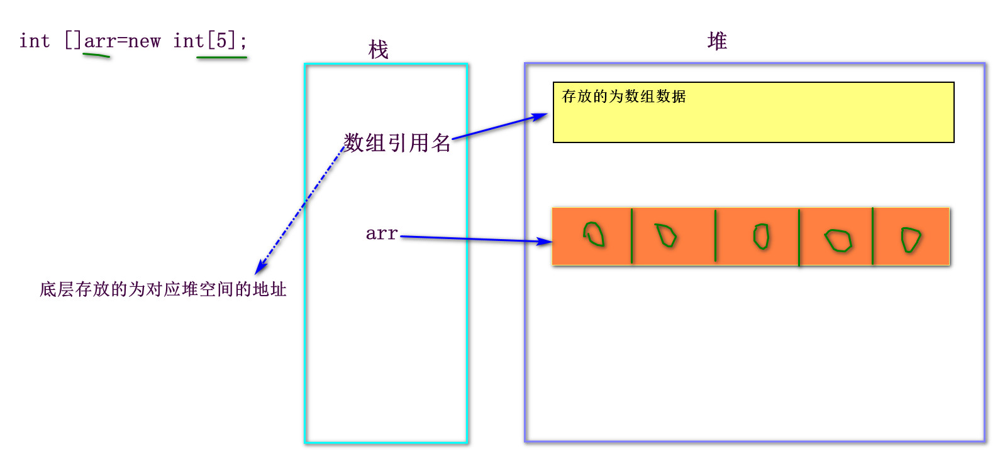

-   寻址公式：数组首元素地址+下标\*数组数据类型对应的字节长度
-   下标从0开始的目的为：一定程度上提高寻址效率
-   **引用类型间相互赋值传递的是堆地址**
    ```java
        int[] a1={1,2,3,4,5};
        int[] a2=a1;//让a2数组与a1数组指向同一个堆地址
        
        a1[2]=66;
        
        //查看a1的值
        for(int i=0;i<a1.length;i++){
          System.out.print(a1[i]+"\t");//1 2 66 4 5
        }
        System.out.println();
        
        //查看a2的值
        for(int i=0;i<a2.length;i++){
          System.out.print(a2[i]+"\t");//1 2 66 4 5
        }
    ```
    > 逢new必开：只要执行到new关键字，则堆中必定开辟新空间

### 数组扩容

1.  创建一个长度更大的数组（通常扩大为原长度两倍）
2.  将原数组的数据复制到新数组中
3.  让原数组指向新数组地址

#### 利用for循环

-   利用for循环实现元素复制

```java
int[] arr={1,2,3,4,5};
    
    //1. 创建一个长度更大的数组（通常扩大为原长度两倍)
    int[] newArr=new int[arr.length*2];
    //2. 将原数组的数据复制到新数组中
    for(int i=0;i<arr.length;i++){//遍历原数组
      newArr[i]=arr[i];
    }//newArr:1 2 3 4 5 0 0 0 0 0
    //3. 让原数组指向新数组地址
    arr=newArr;
```

#### System.arraycopy

-   System.arraycopy(原数组名，原数组复制起始位置，新数组名，新数组存放起始位置，复制长度)
    -   该方法作用为进行元素复制

```java

    int[] arr={1,2,3,4,5};
    
    //1. 创建一个长度更大的数组（通常扩大为原长度两倍)
    int[] newArr=new int[arr.length*2];
    //2. 将原数组的数据复制到新数组中
    System.arraycopy(arr,0,newArr,0,arr.length);
    //3. 让原数组指向新数组地址
    arr=newArr;
```

#### Arrays.copyOf

-   java.util.Arrays.copyOf(原数组名，预期长度)
    -   该方法返回扩容之后的新地址

```java
int[] arr={1,2,3,4,5};
//进行元素复制
arr=Arrays.copyOf(arr,arr.length*2);
```

### 可变长参数

> 解决的问题：多个函数之间行为操作一致，只是参数个数不同所带来的冗余问题

#### 概念

函数中长度可变的参数，本次执行实际参数的长度由调用者的实参个数决定

```java
访问修饰符  返回值类型 函数名(数据类型... 参数名){
   
}
```

#### 使用

1.  可变长参数可以看作数组使用，使用方式与数组一致
    ```java
    public static void main(String[] args){
        System.out.println(add(1,2));
        System.out.println(add(1,2,3));
      }
      //让参数相加求和
      public static int add(int... a){
        int sum=0;//累加器
        for(int i=0;i<a.length;i++){
          sum+=a[i];
        }
        return sum;
      }
    ```
2.  与普通参数一起使用时，其必须定义在最后
3.  一个函数最多定义一个可变长参数

### 排序

#### 冒泡排序

#### 原理

1.  让相邻的两个数字进行比较，根据比较结果决定是否换位
2.  外层循环代表比较轮数，内层循环代表比较的次数
3.  特点：每轮比较结束之后都会确定一个位置的元素（从后往前）

```java
for(int i=1;i<数组名.length;i++){//轮数
      for(int j=0;j<数组名.length-i;j++){//次数  j同时代表数组下标
          //a[j]:当前元素  a[j+1]: 下一位元素
        if(数组名[j+1]<数组名[j]){//从小到大是<,从大到小是>
          //进行值的互换
          int temp=数组名[j];
          数组名[j]=数组名[j+1];
          数组名[j+1]=temp;
        }
      }
    }
```

```java
for(int i=1;i<a.length;i++){//轮数
      for(int j=0;j<a.length-i;j++){//次数  j同时代表数组下标
        if(a[j+1]<a[j]){//从小到大
          int temp=a[j];
          a[j]=a[j+1];
          a[j+1]=temp;
        }
      }
    }
```

#### 选择排序

#### 原理

1.  先固定一个位置，让其他位置与固定位置的元素进行比较，根据比较结果决定是否换位
2.  外层循环代表固定下标，内层循环代表与其比较的下标
3.  每轮比较结束固定位置的值可以被确定

```java
a:表示自定义数组名，使用时将a替换成自己的数组名即可
for(int i=0;i<a.length-1;i++){//固定位置
      for(int j=i+1;j<a.length;j++){//其他位置下标
        if(a[j]<a[i]){//从小到大是<，从大到小是>
          //换位
          int temp=a[i];
          a[i]=a[j];
          a[j]=temp;
        }
      }
    }
```

#### JDK排序

#### 原理

1.  利用java.util.Arrays.sort(数组名)实现快速排序
2.  只能实现从小到大的排序

```java
Arrays.sort(数组名);
如：
Arrays.sort(a);
```

## 今日重点

1.  数组的创建
2.  数组的遍历
3.  数组的扩容步骤及实现方式
4.  数组属于什么数据类型？
5.  数组在内存中怎么存放？
6.  引用类型相互赋值传递的是什么?
7.  排序的三种实现方式的代码

# Day7-面向对象

> 面向对象和面向过程都是编程中的编码思想
> **Java的核心思想就是面向对象**
> **面向对象的实现脱离不了面向过程**
> 面向过程关注的是实现需求的步骤
> 面向对象关注的是实现需求的方法

## 认识对象

### 什么是对象？

-   在Java中：万物皆对象
-   在程序中：是计算机内存的一块存储空间，用来存储对现实生活中对象特征和行为的描述

### 对象的组成

1.  特征：都有什么
2.  行为：能做什么

### 对象和对象间的关系

1.  is a：一个对象继承自另一个对象
    -   狗是一个动物
    -   Dog is a Animal
2.  has a：一个对象是另一个对象的组成部分
    -   电脑由cpu、硬盘、显示器等组成
    -   电脑  has a cpu
    -   电脑 has a 硬盘
    -   电脑 has a 显示器
3.  use a：一个对象使用另一个对象
    -   程序员使用电脑
    -   程序员 use a 电脑

## 重新认识类

### 什么是类？

是对现实生活中对象的共性抽取。通常用来描述同一批具有相同特征和行为的对象

### 类和对象间的关系

1.  类是对象的模板
2.  对象是类的实例
3.  一个模板可以创建多个相同相似的实例

### 类的组成

1.  属性：用来描述对象的特征。也称为成员变量、全局变量、成员属性等
    ```java
    1. 只声明：  常用
       数据类型 属性名;
    2. 声明的同时直接赋值：
       数据类型 属性名=值;

    注意：不能先声明后赋值
    ```
    ```java
    //学生类
    class Student{
      String name;//只声明
      //name="张三"; 先声明后赋值  错误！！！
      int age;
      double score;
      
    }
    ```
    -   位置：类的内部，方法的外部，通常写在类的最上方
    -   特点：存在默认值
        > 默认值为属性创建时编译器进行的赋值
        > 初始值为第一次手动显式赋的值
    -   **属性和局部变量的区别：**
        |      | 局部变量              | 属性                  |
        | ---- | ----------------- | ------------------- |
        | 位置   | 方法内部              | 方法外部                |
        | 默认值  | 没有                | 有                   |
        | 作用范围 | 定义行开始，到直属代码块大括号结束 | 至少整个类               |
        | 命名冲突 | 同一作用范围内不可重名       | 可以与局部变量重名，局部变量优先级更高 |
2.  方法：用来描述对象行为，也成为实例方法、成员方法等
    ```java
    访问修饰符 返回值类型 方法名(形参列表){
       //操作语句
    }
    ```
    > 函数就是加了static的方法
    >
    > -   位置：类的内部，其他方法的外部，与属性平级

```java
//描述学生类
class Student{
  String name;//只声明
  int age;
  double score=90.5;
  
  //行为方法-普通方法：吃饭
  public void eat(){
    System.out.println("吃饭饭");
  }
  //睡觉
  public void sleep(){
    System.out.println("睡觉觉");
  }
  //学习
  public void study(){
    System.out.println("学习习");
  }
  
}
```

> 描述型的类：用来描述某一批对象的类
> 测试类：用来测试执行的类，也就是存在主函数的类

## 对象创建

```java
类名 对象名=new 类名();
如：
   Student s1=new Student();
```

## 对象访问

### 访问属性

```java
取值：对象名.属性名
赋值：对象名.属性名=值;
```

```java
//创建一个学生对象
    Student s1=new Student();
    //赋值
    s1.name="张三";
    s1.age=20;
    s1.score=80;
    //取值
    System.out.println(s1.name);
    System.out.println(s1.age);
    System.out.println(s1.score);
```

### 访问方法

```java
对象名.方法名(实参列表)
```

```java
//调用s1的方法
    s1.eat();
    s1.sleep();
    s1.study();
```

> java.lang.NullPointerException：空指针异常
> 错误原因：使用了null值调用内容或者参与了判断或者参与了运算

## 构造方法

### 概念

是一种特殊的方法，作用为创建对象

```java
1. 无参构造
   访问修饰符 类名(){
   
   }
2. 有参构造
   访问修饰符 类名(形参1,形参2,...){
       属性1=形参1;
       属性2=形参2;
       ...
   }
   
```

```java
示例：
//无参构造
  public Student(){
    
  }
  //有参构造
  public Student(String n,int a,double s){
      //让参数给对应属性赋值
    name=n;
    age=a;
    score=s;
  }
```

### 使用

1.  语法特点：
    -   没有返回值类型部分
    -   方法名必须与类名保持一致
2.  使用特点：
    -   只能通过new关键字调用，不允许手动调用
        > 类名 对象名=new 类名();
        1.  第一个类名：指明创建的是哪个类的对象
        2.  第二个类名：指明调用的是哪个构造方法
    -   作用为创建对象，并且创建对象也只能使用构造
    -   补充：有参构造的使用语法(利用有参构造创建对象)
        ```java
        类名 对象名=new 类名(实参列表);
        ```
        ```java
        如：Student stu=new Student("张三",30,99.5);
        ```
    -   有参构造和无参构造的区别：
        -   无参构造只是单纯的创建对象
        -   有参构造可以在创建对象同时直接给属性赋值
    -   类中默认存在一个无参构造，当类中显式定义构造之后，默认的无参构造将会失效
    -   一个类中可以存在0-1个无参构造，可以存在0-多个有参构造

## 方法重载

### 规则

1.  方法名必须相同
2.  参数列表必须不同
3.  与访问修饰符、返回值类型、异常没有关系

### 作用

方便调用者调用功能相似的不同方法

## 对象的创建过程

-   又名《属性的三个赋值时期》

1.  给属性分配空间，赋默认值
2.  给属性赋初始值
3.  在构造方法中再次赋值

## this关键字

-   this代表当前对象

### this.

-   指明当前类的属性或调用当前类的方法
    ```java
    this.属性名
    this.方法名(实参列表)
    ```
-   位置：可以存在于构造方法或普通方法内部
-   修改有参构造：
    ```java
    public Student(String name,int age,String sex,double score){//形参：局部变量
        this.name=name;
        this.age=age;
        this.sex=sex;
        this.score=score;
      }
    ```

### this()

-   作用：用来调用本类其他构造的内容
-   使用：
    1.  必须写在构造方法有效代码第一行
    2.  由实参列表决定调用的是哪个构造
    3.  不能自己调用自己
    4.  不能循环调用
    ```java
    class Student{
      String name;
      int age;
      String sex;
      double score;
      
      public Student(){
        //this(); 自己调用自己  错误！
        //this("赵六"); 循环调用  错误！
        System.out.println("这是无参构造");
      }
      
      public Student(String name,int age,String sex,double score){//形参：局部变量
        this();//调用无参构造的内容
        System.out.println("这是全属性赋值的有参构造");
        this.name=name;
        this.age=age;
        this.sex=sex;
        this.score=score;
      }
      
      public Student(String name){
        this("李四",20,"男",90.5);
        System.out.println("这是只给姓名赋值的有参构造");
        this.name=name;
      }
      
    }
    ```

## 今日重点

1.  对象与对象间的关系
2.  类与对象间的关系
3.  属性和局部变量的区别
4.  构造方法的语法特点
5.  方法重载的规则
6.  对象的创建过程
7.  this关键字代表什么及其作用

# Day8-封装

## 概念

是一个屏障，用来保护对象内容不被外界任意访问

## 步骤

1.  属性私有化
    ```java
    private 数据类型 属性名;
    ```
    |         | 含义      | 作用范围       |
    | ------- | ------- | ---------- |
    | public  | 公共的、公开的 | 任意位置都可访问   |
    | private | 私有的     | 只有本类内部可以访问 |
    > 理论上可以选择性的对属性进行私有化，但是通常所有属性都必须参与私有化
    > -   修改属性：
    >     ```java
    >     class BankCard{
    >       private String cardID;
    >       private String password;
    >       private double balance;
    >     ```
    
          public BankCard(){}
          public BankCard(String cardID,String password,double balance){
            this.cardID=cardID;
            this.password=password;
            this.balance=balance;
          }
          
        }
        ```
2.  提供用来取值和赋值的getter、setter方法
    -   取值-getter
        ```java
        public 返回值类型 getXxx(){
           retuen 对应属性名;
        }
        注意：Xxx表示对应属性名，首字母大写
        ```
        -   特点：有返回值，没有参数
        -   返回值类型与对应属性保持一致
    -   赋值-setter
        ```java
        public void setXxx(数据类型 形参-属性名){
           this.属性名=属性名;
        }
        注意：Xxx表示对应属性名，首字母大写
        ```
        -   特点：没有返回值，有参数
        -   形参的数据类型与对应属性保持一致
    > 可以选择性的对私有化属性提供getter、setter方法，但是通常情况下所有私有化属性都必须提供getter、setter方法

```java
//银行卡类：卡号、密码、余额
class BankCard{
  private String cardID;
  private String password;
  private double balance;
  
  //卡号
  public String getCardID(){
    return cardID;
  }
  public void setCardID(String cardID){
    this.cardID=cardID;
  }
  
  //密码
  public String getPassword(){
    return password;
  }
  public void setPassword(String password){
    this.password=password;
  }
  
  //余额-取值
  public double getBalance(){
    return balance;
  }
  //赋值
  public void setBalance(double balance){
    this.balance=balance;
  }
  
  public BankCard(){}
  public BankCard(String cardID,String password,double balance){
    this.cardID=cardID;
    this.password=password;
    this.balance=balance;
  }
  
}
```

## 属性访问

-   属性封装之后，不可再直接调用属性访问，必须通过调用对应getter、setter方法的形式进行访问

```java
取值：对象名.getXxx()
赋值：对象名.setXxx(实参)
```

```java
class Test{
  public static void main(String[] args){
    BankCard bc=new BankCard("62111111111111111","123456",100.0);
    
    bc.setBalance(100000.0);
    bc.setCardID("62888888888888888");
    bc.setPassword("666666");
    
    System.out.println(bc.getBalance());
    System.out.println(bc.getCardID());
    System.out.println(bc.getPassword());
    
    //bc.balance=10000000.0;
    
    
    /* System.out.println(bc.balance);
    System.out.println(bc.cardID);
    System.out.println(bc.password); */
  }
}
```

> 实体类(描述型的类)的书写顺序：

1.  属性（直接添加私有化private）
2.  getter、setter
3.  有参无参构造
4.  写普通行为方法（如果有）

## 今日重点

1.  封装的步骤
2.  getter、setter方法的语法

# Day9-继承

> 面向对象三大核心思想：封装、继承、多态

## 概念

将子类的共性进行抽取，生成父类

在继承关系下，子类可以继承并拥有父类的所有可继承内容

```java
class 子类类名 extends 父类类名{
   
}
```

## 前提

建立在is a关系之上

> 狗是一个动物   Dog is a Animal
> 猫是一个动物  Cat is a Animal
> **子类 is  a  父类**

## 使用规则

1.  一个子类只能有一个直接父类，一个父类可以拥有多个直接子类
2.  子类在继承父类内容的基础上可以存在自身的独有内容
3.  子类的独有内容父类无法访问
4.  子类在身为子类的同时也可以是其他类的父类
5.  子类可以继承并拥有直接父类及间接父类中所有可被继承的内容
6.  父类的私有内容子类无法直接继承访问
7.  父类的构造子类也无法继承

## 父类封装

> 由于父类也是描述型的类，所以为了数据安全，父类属性也应该进行封装

-   父类封装之后，子类无法直接访问封装属性，必须通过getter、setter方法访问

```java
class Animal{//父类
  private String name;
  private int age;
  private String color;
  
  public String getName(){
    return name;
  }
  public void setName(String name){
    this.name=name;
  }
  public int getAge(){
    return age;
  }
  public void setAge(int age){
    this.age=age;
  }
  public String getColor(){
    return color;
  }
  public void setColor(String color){
    this.color=color;
  }

  public void eat(){
    System.out.println("吃饭饭");
  }
  public void sleep(){
    System.out.println("睡觉觉");
  }
}
//子类
class Dog extends Animal{

  //独有方法-看门
  public void lookDoor(){
    System.out.println("看门门");
  }
}

//测试类
class Test{
  public static void main(String[] args){
    Dog dog=new Dog();
    
    //dog.name="小黑";
    dog.setName("小黑");
    System.out.println(dog.getName());
    
    
  }
}
```

### 子类的内存结构

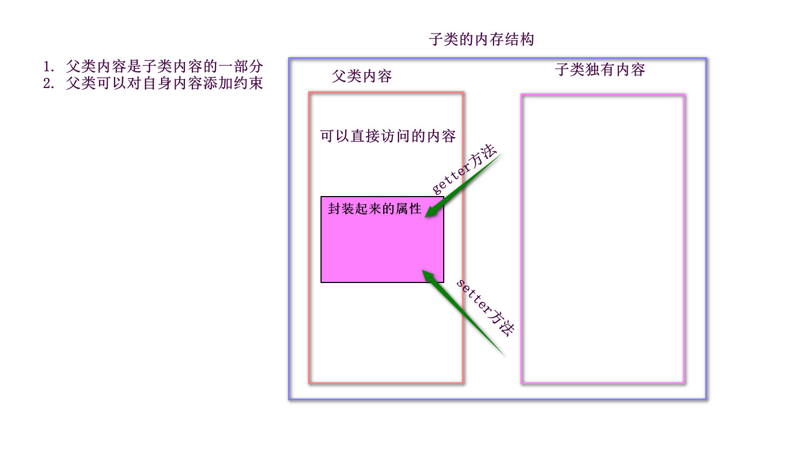

## 方法重写(覆盖)

-   指子类对从父类继承过来的方法进行方法体的重新书写

### 规则

1.  建立在继承关系之上
2.  方法名、参数列表、返回值类型必须与父类保持一致
3.  访问修饰符必须与父类相同或者更宽
4.  子类不允许抛出比父类更大或更多的异常

### 使用

当子类对父类方法进行重写之后，子类对象优先使用自身重写之后的内容

> 继承的作用：

1.  解决类与类之间的代码冗余问题
2.  可以借助父类强制约束子类必须拥有某些内容

### 访问修饰符

-   作用：决定类之间内容的访问权限

|                | 本类 | 同包 | 非同包子类 | 非同包非子类 |
| -------------- | -- | -- | ----- | ------ |
| public：公共的、公开的 | √  | √  | √     | √      |
| protected：受保护的 | √  | √  | √     |        |
| default：默认的    | √  | √  |       |        |
| private：私有的    | √  |    |       |        |

-   只有public和default可以修饰类
-   default不可显式声明
-   以上四个都可以修饰属性、方法、构造
-   以上四个都不可以修饰局部变量

## 有继承关系的对象创建过程

1.  给父子类属性分配空间，赋默认值
2.  给父类属性赋初始值
3.  利用父类构造给父类属性再次赋值
4.  给子类属性赋初始值
5.  利用子类构造给子类属性再次赋值

-   总结：先构建父类内容才能构建子类内容

## 对象的内存存储

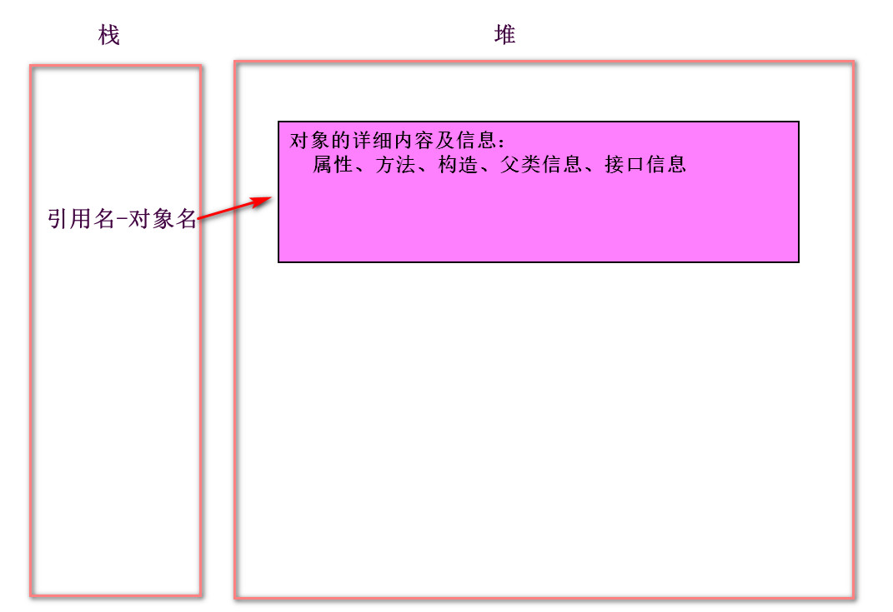

## Super关键字

-   代表父类对象

### super.

-   指明父类的属性和方法

```java
super.属性名
super.方法名(实参)
```

-   无法直接通过**super.属性**名访问父类封装属性

### super()

-   用来调用父类构造内容
-   必须写在子类构造方法有效代码第一行
-   子类构造第一行默认存在一个无参的**super()**
-   可以利用super(实参)在子类有参构造中调用父类有参构造实现利用子类有参构造创建子类对象时给父类属性直接赋值的效果
    ```java
    class Animal{//父类
      private String name;
      private int age;
      private String color;
      
       //省略getter、setter
      
      public Animal(){}
      public Animal(String name,int age,String color){
        this.name=name;
        this.age=age;
        this.color=color;
      }
      
    }

    //子类
    class Dog extends Animal{
      
      public Dog(){
        //super();
        
      }
      public Dog(String name,int age,String color){//name="小黑"  age=1   color="白色"
        super(name,age,color);
      }
      
    }

    //测试类
    class Test{
      public static void main(String[] args){
        Dog dog=new Dog("小黑",1,"白色");
        
        System.out.println(dog.getName());
        System.out.println(dog.getAge());
        System.out.println(dog.getColor());
        
        Dog d=new Dog();
        
    }
    ```
-   this()和super()不可同时显式存在

## 今日重点

1.  继承的前提
2.  继承的规则
3.  方法重写的规则
4.  四个访问修饰符及其修饰范围
5.  有继承关系的对象创建过程
6.  this和super的区别

# Day10-多态

## 概念

父类引用可以指向不同的子类对象

```java
父类类名 引用名=new 子类类名();
```

## 使用

1.  建立在继承关系之上
2.  实际创建的是子类对象
3.  优先执行子类重写之后的内容
4.  父类引用无法访问子类独有内容
    -   **编译器关注的是引用类型，解释器关注的是实际对象类型**
    -   语法中等号左边决定引用都能做什么，等号右边决定实际上是什么

```java
class Animal{//父类
  private String name;
  private int age;
  private String color;
  
  //省略getter、setter、构造
  
  public void eat(){
    System.out.println("吃饭饭");
  }
  public void sleep(){
    System.out.println("睡觉觉");
  }
  
}

//子类
class Cat extends Animal{
  //重写父类方法eat
  public void eat(){
    System.out.println("猫吃小鱼干");
  }
  
  //独有方法-玩毛线
  public void playMaoXian(){
    System.out.println("玩毛线");
  }
}

//子类
class Dog extends Animal{
  
  public Dog(){
  }
  public Dog(String name,int age,String color){
    super(name,age,color);
  }
  
  //重写父类方法eat
  public void eat(){
    System.out.println("狗吃大骨头");
  }

  //独有方法-看门
  public void lookDoor(){
    System.out.println("看门门");
  }
}

//测试类
class Test{
  public static void main(String[] args){
    
    Dog dog=new Dog();//狗是一个狗
    Cat cat=new Cat();//猫是一个猫
    
    Animal a1=new Dog();//狗是一个动物
    Animal a2=new Cat();//猫是一个动物
    
    
    a1.eat();//狗吃大骨头
    //a1.lookDoor();  编译报错
    a2.eat();//猫吃小鱼干
  
  }
}
```

## 引用类型间的相互转换

### 自动类型转换

-   子类对象赋值给父类引用

```java
父类类名 引用名=子类对象|子类引用;
```

```java
Dog dog=new Dog();
Animal a3=dog;

Animal a1=new Dog();
```

### 强制类型转换

-   父类引用赋值给子类引用

```java
子类类名 引用名=(子类类名)父类引用名;
```

```java
Animal a1=new Dog();//狗是一个动物
    //将a1强转为Dog类型
    Dog d=(Dog)a1;
```

1.  只能转向父类引用原本指向的子类类型
    ```java
    Animal a1=new Dog();//狗是一个动物
    //Cat c=(Cat)a1;编译不报错，运行报错
    ```
    -   编译不报错，运行报错
        -   java.lang.ClassCastException：类型转换异常
2.  子类之间不能进行强转
    ```java
    Dog dog=new Dog();
    //Cat c=(Cat)dog; 错误
    ```
    -   编译就会报错

## 多态的使用场景

1.  用于数组
    -   将数组类型声明为父类类型，则数组中可以存放不同的子类对象
    ```java
    Animal[] as={new Dog(),new Dog(),new Cat()};
        /* 相当于：
        as[0]=new Dog();     //Animal =new Dog();
        as[1]=new Dog();
        as[2]=new Cat(); */
        
        for(int i=0;i<as.length;i++){
          as[i].eat();
        }
    ```
2.  用于参数
    -   将形参类型声明为父类类型，则实参可以传入不同的子类对象
    ```java

      //定义一个函数，传入参数，要求可以执行出“看门”或者"玩毛线"
      public static void method4(Animal a){
        //类型判断
        if(a instanceof Dog){
          Dog d=(Dog)a;
          d.lookDoor();
        }else if(a instanceof Cat){
          Cat c=(Cat)a;
          c.playMaoXian();
        }
        
      }

    public static void main(String[] args){
        method4(new Dog());
        method4(new Cat());
      }
      
    ```
3.  用于返回值
    -   将返回值声明为父类类型，则可以return返回不同的子类对象
        -   接收方法返回值时，也应该使用父类类型接收
    ```java
    //定义一个函数，传入整型参数n，判断n的奇偶性，偶数返回Dog对象,否则返回Cat对象
      public static Animal method5(int n){
        if(n%2==0){
          return new Dog();
        }else{
          return new Cat();
        }
        
      }

      public static void main(String[] args){
        Animal a=method5(6);
        
        a.eat();
        
      }
    ```

## instanceof关键字

### 作用

判断引用是否与指定类型兼容，兼容返回true，不兼容返回false

### 语法

```java
引用名  instanceof  类名
```

### 使用

1.  子类对象可以被父类类型兼容
2.  多态时，父类引用只能兼容指向的子类类型

```java
public static void method(){
    //利用多态创建Dog对象
    Animal a=new Dog();
    System.out.println(a instanceof Animal);//t
    System.out.println(a instanceof Dog);//t
    System.out.println(a instanceof Cat);//f
    
    //直接创建Dog对象
    Dog d=new Dog();
    System.out.println(d instanceof Animal);//t
    System.out.println(d instanceof Dog);//t
    //System.out.println(d instanceof Cat);   编译报错，无效的比较
  }
```

```java
//定义一个函数，传入一个Animal类型的数组，
  //要求：遍历数组，输出“看门门”或“玩毛线”
  //并在主函数中调用测试
  public static void method2(Animal[] as){
    
    for(int i=0;i<as.length;i++){
      //判断是否兼容Dog
      if(as[i] instanceof Dog){
        //强转成Dog
        Dog d=(Dog)as[i];
        d.lookDoor();
      }else if(as[i] instanceof Cat){
        //强转成Cat
        Cat c=(Cat)as[i];
        c.playMaoXian();
      }
    }
  }


public static void main(String[] args){
    Animal[] as={new Dog(),new Dog(),new Cat()};
    method2(as);
    
  }
```

## 多态的好处

1.  减少代码冗余
2.  更加贴合现实逻辑
3.  解耦合

## 今日重点

1.  多态的语法
2.  引用类型间的强转
3.  多态的使用场景
4.  instanceof关键字的使用

# Day11-三大修饰符

## abstract-抽象

抽象的，不是真实存在的

### 抽象类

```java
abstract class 类名{
   
}
注意：修饰符之间的顺序不做要求
   public abstract class 类名{}
   abstract public class 类名{}
```

#### 使用

1.  无法实例化对象
2.  通常父类都是抽象类
3.  抽象父类仍然可以参与多态
4.  抽象父类仍然存在构造，用于支持子类创建对象
5.  抽象类中可以存在非抽象内容

### 抽象方法

```java
访问修饰符 abstract 返回值类型 方法名(形参列表);
abstract 访问修饰符 返回值类型 方法名(形参列表);
```

#### 使用

1.  抽象方法必须存在于抽象类
    > 抽象类和抽象方法的关系：
    1.  抽象类中可以没有抽象方法
    2.  抽象方法必须存在于抽象类
2.  子类必须重写父类中的抽象方法
    
    -   除非子类自身也是抽象类（不推荐）
3.  抽象父类中的行为方法理论上都应该是抽象方法

> 抽象父类的作用：

1.  解决子类间的代码冗余问题
2.  约束子类拥有某些内容
3.  可以强制约束子类必须重写某些内容

## static-静态

### 修饰属性

-   静态属性，也称为静态变量、类变量

```java
static 数据类型 属性名;
```

#### 使用

1.  **不再独属于某个对象，而是被该类所有对象共享**
2.  可以直接通过**类名.属性名**的方式访问静态属性
3.  如果静态属性进行了封装，则只能通过如果静态属性进行了封装，则只能通过**任一对象名.getter()|setter()****任一对象名.getter()|setter()** 的方式访问封装静态属性 的方式访问封装静态属性

```java
class ClassA{
  static private int count=0;//静态累加器属性,记录对象数量
  
  public int getCount(){
    return count;
  }
  public void setCount(int count){
    this.count=count;
  }
  
  public ClassA(){
    count++;
  }
}

class Test{
  public static void main(String[] args){
    //统计ClassA的对象创建数量
    ClassA c1=new ClassA();
    ClassA c2=new ClassA();
    ClassA c3=new ClassA();
    ClassA c4=new ClassA();
    
    /* System.out.println(c1.count);
    System.out.println(c2.count);
    System.out.println(c3.count);
    System.out.println(c4.count);  该访问方式的前提是：静态属性未封装 */
    
    //System.out.println(ClassA.count);//4  该访问方式的前提是：静态属性未封装
    
    System.out.println(c1.getCount());//4
    System.out.println(c2.getCount());//4
    System.out.println(c3.getCount());//4
    System.out.println(c4.getCount());//4
    
    
  }
}
```

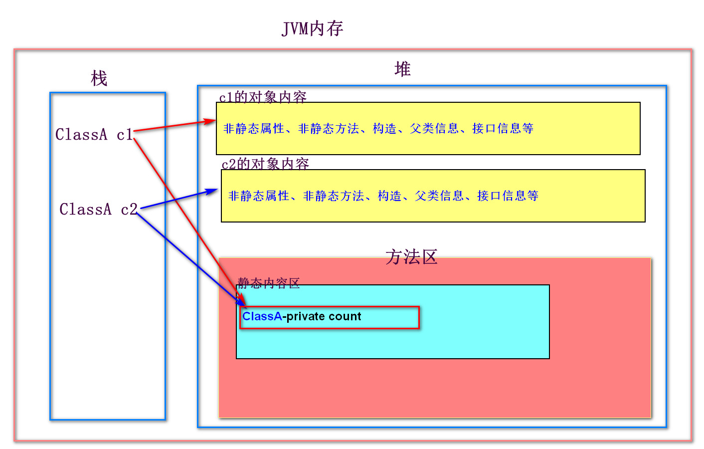

1.  方法区JDK8.0之后被归纳到了堆之中
2.  静态内容都会单独的存放在方法区的静态内容区中

### 修饰方法

-   也就是函数，也称为静态方法

#### 使用

1.  无法访问非静态内容
    -   可以通过可以通过**类名.方法名()****类名.方法名()** 的形式直接访问类中的静态方法 的形式直接访问类中的静态方法
    -   非静态内容必须存放在对象内存中，很有可能在使用静态方法时非静态内容还未创建
    -   非静态的实例方法对内容的访问不做要求
2.  静态方法中无法使用this和super关键字
    -   访问静态方法时有可能当前对象和父类对象并未创建
3.  无法修饰局部变量
    -   局部变量的作用范围限制其无法成为类变量
4.  无法修饰构造
    -   构造方法只能通过new关键字调用
5.  子类可以继承并重写父类静态方法，但是在多态的前提下，执行的仍然是父类内容
    -   静态内容的执行只关注引用类型

> **类加载（纯概念）**

1.  什么是类加载？
    -   当**第一次使用类内容**时，通过**CLASSPATH类路径**找到当前类的**字节码文件**，将文件中的内容加载到**JVM虚拟机**中的过程称之为类加载。通常，**类加载只会发生一次**
2.  类加载的时机？
    -   第一次创建类的对象时
    -   第一次访问静态内容时
    -   通过通过**Class.forName("全限定名")****Class.forName("全限定名")** 的方式强制触发类加载 的方式强制触发类加载
        -   类的完整路径：包名.类名
    -   子类进行类加载时，也会触发父类的类加载
    -   只声明引用不会触发类加载

### 修饰初始代码块(了解)

> 什么是初始代码块？

-   在执行构造前会优先执行的内容

```java
class 类名{
   {
      //这是初始代码块
   }
}
```

-   位置：类之内，方法之外，与属性和方法平级，通常写在属性正下方
-   特点：在创建对象时执行

#### static+初始代码块

```java
class 类名{
   static{
      //这是静态初始代码块
   }
}
```

-   特点：会在类加载的时候触发，只会执行一次
-   无法访问非静态内容

## final-最终

### 修饰属性

变成常量属性，值不可改

#### 使用

1.  常量属性没有默认值
2.  常量属性在创建时必须进行初始化
3.  初始化时机：
    1.  直接赋值
    2.  初始代码块赋值
    3.  构造赋值
        -   必须保证每个构造中都有赋值语句

```java
class ClassB{
  final int NUMBER=100;//直接赋值
  final int NUMBER2;
  final int NUMBER3;
  {
    NUMBER2=200;//初始代码块赋值
  }
  
  public ClassB(){
    NUMBER3=300; 
  }
  public ClassB(String s){
    NUMBER3=300;
  }
}
```

### 修饰方法

变成最终的方法，不可被重写

### 修饰类

变成断子绝孙类，不可被继承

> 修饰局部变量：变成常量，值不可改
> 修饰引用时，地址不可改但是对象内容可改

## 总结

1.  abstract不能与private、static、final联用
2.  private、static、final之间可以任意结合

## 今日重点

1.  抽象类和抽象方法的关系
2.  静态属性和静态方法的使用
3.  什么是类加载？
4.  类加载的时机
5.  final都能修饰什么及修饰后的特点

> 建项目-->建包-->建类(一个源文件对应一个类)

1.  实体类(描述型的类)：com.xxx.entity
2.  测试类：com.xxx.test

# Day12-接口

## 概念

从功能上看：实现接口就意味着扩展了某些功能

从规则上看：是接口定义者和接口实现者都需要遵守的某些规则

## 语法

```java
interface 接口名{
   
}
```

> 包：com.xxx.dao

```java
package com.bz.dao;

public interface IA {

}
```

## 使用

1.  接口中的方法都是公开抽象方法(public abstract)
    -   由于修饰符固定，所以可以省略或缺失，编译器会自动补全
2.  接口中的属性必须是公开静态常量（public static final）
3.  无法实例化对象，并且不存在构造方法

```java
public interface IA {
    public static final int NUMBER=100;
    int NUMBER2=100;

    public abstract void ma();
    void mb();

}
```

## 实现类

```java
class 类名 implements 接口名{
   
}
```

> 包：com.xxx.dao.impl

## 使用

1.  实现类必须重写接口中的所有抽象方法，除非实现类为抽象类
    ```java
    package com.bz.dao.impl;

    import com.bz.dao.IA;

    /**
     * 实现类
     */
    public class IAImpl implements IA {

        public void ma() {
            System.out.println("这是IAImpl中的ma");
        }

        public void mb() {
            System.out.println("这是IAImpl中的mb");
        }
    }
    ```
2.  一个实现类可以实现多个接口，一个接口也可以拥有多个实现类（**多实现**）
    ```java
    class 类名 implements 接口名1,接口名2,...{
       
    }
    ```
3.  实现多个接口时，必须对所有接口中的所有抽象方法都提供方法重写
    ```java
    package com.bz.dao;

    public interface IB {
        void mc();
        void md();
    }
    ```
    ```java
    package com.bz.dao.impl;

    import com.bz.dao.IA;
    import com.bz.dao.IB;

    /**
     * 实现类
     */
    public class IAImpl implements IA , IB {
        //重写IA中的方法
        public void ma() {
            System.out.println("这是实现IA中的ma");
        }

        public void mb() {
            System.out.println("这是实现IA中的mb");
        }

        //重写IB中的方法
        public void mc() {
            System.out.println("这是实现IB中的mc");
        }

        public void md() {
            System.out.println("这是实现IB中的md");
        }
    }

    ```
4.  一个类可以在继承父类的同时实现接口(先继承，再实现)
    ```java
    class 类名 extends 父类类名 implements 接口名{
       
    }
    ```
5.  接口仍然可以参与多态
    ```java
    接口名 引用名=new 实现类名();
    ```
    ```java
    package com.bz.test;

    import com.bz.dao.IA;
    import com.bz.dao.IB;
    import com.bz.dao.impl.IAImpl;
    import com.bz.entity.Super;

    public class Test {
        public static void main(String[] args) {
            //利用多态创建实现类对象
            IA ia = new IAImpl();
            ia.ma();
            ia.mb();

            IB ib = new IAImpl();
            ib.mc();
            ib.md();

            Super s = new IAImpl();
            s.method();
            //直接创建实现类对象
            IAImpl impl = new IAImpl();
            impl.ma();
            impl.mb();
            impl.mc();
            impl.md();
            impl.method();

        }
    }
    ```
6.  利用接口作为引用时，接口引用只能调用自身声明的方法，实现类中的其他方法该引用无法访问
    -   如果需要使用实现类独有内容，则可以进行引用类型强转
        ```java
        实现类类名 引用名=(实现类类名)接口引用名;
        ```
        ```java
        IA ia = new IAImpl();
                ia.ma();
                ia.mb();

                //将ia引用强制为实现类引用
                IAImpl impl = (IAImpl) ia;
                //通过实现类引用调用独有方法
                impl.mc();
                impl.md();
                impl.method();
        ```
        -   只能转向原本指向的实现类类型
        -   实现类之间不可强转

## 接口间的继承

一个接口可以继承多个接口（**多继承**）

-   子接口可以继承拥有父接口的所有内容

```java
public interface IC extends IA,IB{

}
```

## 接口和抽象类的区别

|     | 抽象类            | 接口        |
| --- | -------------- | --------- |
| 关键字 | abstract class | interface |
| 属性  | 没有具体要求         | 必须为公开静态常量 |
| 方法  | 可以存在非抽象方法      | 都是公开抽象方法  |
| 构造  | 有              | 无         |
| 继承性 | 单继承            | 多继承       |

## 接口高级

### 高版本的接口

#### JDK8.0

1.  默认方法
    ```java
    default 返回值类型 方法名(形参列表){
       //操作语句
    }
    ```
    -   当父类方法与接口方法出现冲突时，优先执行父类内容（**类优先原则**）
    -   当两个接口的方法出现冲突时，实现类必须再次重写该方法，使用自身重写内容
2.  静态方法
    ```java
    static 返回值类型 方法名(形参列表){
       //操作语句
    }
    ```

#### JDK9.0

1.  私有方法
    ```java
    private 返回值类型 方法名(形参列表){
       //操作语句
    }
    ```

### 接口回调

-   本质就是**将方法形参声明为接口类型，则在调用该方法时可以传入不同的实现类对象**
-   好处：提高方法复用度

> "开闭原则"：扩展开放，修改关闭

-   对一段代码进行功能扩展时，允许扩展，但是不允许修改已经存在的代码

#### 案例-比较器排序

1.  创建Comparator接口实现类对象，重写compare方法
    ```java
    public class 实现类名 implements Comparator<被排序的类名> {
        @Override
        public int compare(被排序的类名 o1, 被排序的类名 o2) {
            //return 0;
        }
    }
    ```
2.  书写排序规则
    -   从小到大：
        -   o1的值>o2的值返回正数，o1的值\<o2的值返回负数
    -   从大到小：
        -   o1的值>o2的值返回负数，o1的值\<o2的值返回正数
    -   相等返回0
    ```java
    public class StudentCompareImpl implements Comparator<Student> {
        @Override
        public int compare(Student o1, Student o2) {
            //根据学生年龄从小到大排序
            //o1的值>o2的值返回正数，o1的值<o2的值返回负数
            if (o1.getAge() > o2.getAge()) {
                return 1;
            } else if (o1.getAge() < o2.getAge()) {
                return -1;
            } else {
                return 0;
            } 
        }
    }
    ```
3.  在Arrays.sort()中传入比较器实现类对象
    -   Arrays.sort(被排序的数组名,比较器实现类对象)；
    ```java
    package com.bz.test;

    import com.bz.dao.impl.StudentCompareImpl;
    import com.bz.entity.Student;

    import java.util.Arrays;

    public class Test2 {
        public static void main(String[] args) {
          //  int[] a = {8, 66, 4, 7, 99};
            //学生对象数组
            Student[] a = {new Student("张三", 20, 88.0),
                    new Student("李四", 18, 90.0),
                    new Student("王五", 25, 78.5),
                    new Student("赵六", 18, 60.0),
                    new Student("孙七", 18, 80.5)};

            Arrays.sort(a,new StudentCompareImpl());
            for (int i = 0; i < a.length; i++) {
                System.out.println(a[i].getName()+" "+a[i].getAge()+" "+a[i].getScore());
            }
        }
    }

    ```

## 接口的好处

1.  解耦合：将方法声明与方法实现分离，为接口回调做支持
2.  提高代码的复用性
3.  使项目结构更加清晰

## 今日重点

1.  接口和实现类的使用
2.  接口和抽象类的区别
3.  高版本的接口都添加了哪些方法
4.  什么是单继承、多继承、多实现、类优先
5.  接口回调的使用

# Day13-内部类

## 概念

在类的内部再次定义类

## 作用

打破封装，又不破坏封装

## 分类

1.  成员内部类
2.  静态内部类
3.  局部内部类
4.  匿名内部类（掌握）

## 成员内部类

### 位置

类的内部，方法的外部，与属性和方法平级

```java
class 外部类类名{
   class 内部类类名{
      
   }
}
```

### 使用

1.  无法定义静态内容，可以访问外部类的静态内容
2.  当外部类属性、内部类属性、内部类局部变量重名时：
    -   内部类局部变量：变量名
    -   内部类属性：this.属性名
    -   外部类属性：外部类类名.this.属性名
3.  对象创建需要基于外部类对象
    ```java
    外部类类名.内部类类名 对象名=外部类对象名.new 内部类类名();
    ```

```java
package com.bz.entity;
/**
 * 成员内部类
 */
public class Outer1 {
    static String s = "这是外部类的静态属性";
    String str = "这是外部类属性str";

    public class Inner1{//成员内部类
        String str = "这是内部类属性str";

        public void method(){
            String str = "这是内部类局部变量str";
            System.out.println(str);//局部变量
            System.out.println(this.str);//内部类属性
            System.out.println(Outer1.this.str);//外部类属性

            System.out.println(s);
        }

    }

}

```

```java
package com.bz.test;

import com.bz.entity.Outer1;

public class Test {
    public static void main(String[] args) {
        //创建外部类对象
        Outer1 outer1 = new Outer1();
        //创建成员内部类对象
        Outer1.Inner1 inner1 = outer1.new Inner1();

        inner1.method();

    }
}

```

## 静态内部类

### 位置

与成员内部类相同

```java
class 外部类类名{
   static class 内部类类名{
      
   }
}
```

### 使用

1.  可以定义静态内容，无法访问外部类非静态内容
2.  当外部类静态属性和内部类静态属性重名时：
    -   外部类属性：外部类类名.属性名
    -   内部类属性：内部类类名.属性名
3.  对象创建基于外部类类名
    ```java
    外部类类名.内部类类名 对象名=new 外部类类名.内部类类名();
    ```
4.  可以通过可以通过**外部类类名.内部类类名.方法名()****外部类类名.内部类类名.方法名()** 的方式直接访问静态内部类的静态方法 的方式直接访问静态内部类的静态方法

```java
package com.bz.entity;

/**
 * 静态内部类
 */
public class Outer2 {
    int n=10;
    static int num=100;
    static String str = "外部类静态属性str";

    public static class Inner2{//静态内部类
        static String str="这是内部类的静态属性str";

        public static void method(){
            System.out.println(Inner2.str);//内部类的静态属性str
            System.out.println(Outer2.str);//外部类静态属性str

            System.out.println(num);
        }

        public void method2(){
            System.out.println(this.str);//内部类的静态属性str
            System.out.println(num);
        }
    }
}

```

```java
package com.bz.test;

import com.bz.entity.Outer2;

public class Test {
    public static void main(String[] args) {

        //创建静态内部类对象
        Outer2.Inner2 inner2 = new Outer2.Inner2();
        inner2.method();
        inner2.method2();
        //访问静态方法method的第二种方式
        Outer2.Inner2.method();

    }
}

```

## 局部内部类

### 位置

定义在外部类方法内部，和局部变量平级

```java
class 外部类类名{
   访问修饰符 返回值类型 方法名(形参列表){
      class 内部类类名{
         
      }
   }
}
```

### 使用

1.  作用范围：从定义行开始，至直属代码块大括号结束
2.  无法定义静态内容，可以访问外部类静态内容
3.  可以访问外部类的局部变量，前提该变量必须是个常量|事实意义上的常量
    -   JDK7.0之前：必须通过final修饰
    -   JDK7.0之后：未更改过值即可
4.  只能在所属方法内部创建对象

```java
package com.bz.entity;

/**
 * 局部内部类
 */
public class Outer3 {
    static int n=100;//外部类静态属性

    public void method(){
        int num=10;
        //num=20;

        class Inner{//局部内部类
            public void ma(){
                System.out.println(n);
                System.out.println(num);
            }
        }

        //创建局部内部类对象
        Inner inner = new Inner();
        inner.ma();
    }


}

```

## 匿名内部类

### 位置

出现在利用多态创建子类对象|实现类对象时

### 特点

同时将类的声明、方法的定义、对象的创建三合一

### 作用

生成**一个**子类|实现类对象

### 语法

```java
父类类名|接口名   引用名=new 父类类名|接口名(){
  //类的具体内容 
};
```

### 使用

1.  必须继承自某个父类或者实现自某个接口
2.  一个匿名内部类只能创建一个对象
3.  内部只存在一个默认的无参构造，不可显式定义构造
4.  可以定义独有内容，只能在自身类的内部使用
    -   独有内容在多态的前提下引用无法访问，并且匿名内部类无法参与类型强转
5.  不能定义静态内容
6.  无法重写父类的静态方法

### Lambda表达式

-   JDK8.0

> 接口的分类：

1.  常量式接口：只定义了常量，未定义方法
2.  标记式接口：未定义任何内容
3.  函数式接口：只存在一个需要重写的方法
4.  普通接口：存在多个需要重写的方法

-   Lambda表达式只能作用于函数式接口

#### 作用

用来简化大部分的匿名内部类，生成一个接口实现类对象

#### 语法

```java
(形参列表)->{操作语句};
结合引用：
   接口名 引用名=(形参列表)->{操作语句};
```

-   小括号内是**形参列表**
-   大括号内是重写的方法体部分

```java
public interface IA {
    void m1();
}
```

```java
public interface IB {
    /**
     * 判断输出n是否是偶数
     * @param n
     */
    void m2(int n);
}
```

```java
public interface IC {
    /**
     * 输出参数和
     * @param a
     * @param b
     */
    void m3(int a,int b);
}
```

```java
public interface ID {
    /**
     * 计算参数和并返回
     * @param a
     * @param b
     * @return
     */
    int m4(int a,int b);
}
```

```java
package com.bz.test;

import com.bz.dao.IA;
import com.bz.dao.IB;
import com.bz.dao.IC;
import com.bz.dao.ID;

public class Test3 {
    public static void main(String[] args) {
        //匿名内部类创建IA实现类对象
        IA ia1=new IA() {
            @Override
            public void m1() {
                System.out.println("这是匿名内部类中的m1");
            }
        };

        //用lambda创建一个IA接口的实现类对象
        IA ia2=()->{
            System.out.println("这是lambda中的m1");
        };
        ia2.m1();

        //用lambda创建一个IB接口的实现类对象
        IB ib1=(int n)->{
            System.out.println(n % 2 == 0 ? "偶数" : "不是偶数");
        };
        ib1.m2(6);

        //用lambda创建一个IC接口的实现类对象
        IC ic1=(int a,int b)->{
            System.out.println(a + b);
        };
        ic1.m3(1, 1);

        //用lambda创建一个ID接口的实现类对象
        ID id1=(int a,int b)->{
            return a + b;
        };
        System.out.println(id1.m4(2,2));
    }
}

```

#### 简化标准

1.  形参的数据类型可省（要省则全省）
2.  如果参数只有一个，则小括号可省
3.  如果操作语句只有一条，大括号可省
4.  如果操作语句只有一条并且为return语句时，大括号和return都可省（要省则全省）

```java
      //用lambda创建一个IA接口的实现类对象
        IA ia3=()->System.out.println("这是lambda中的m1");
        //用lambda创建一个IB接口的实现类对象
        IB ib2=n->System.out.println(n % 2 == 0 ? "偶数" : "不是偶数");
        //用lambda创建一个IC接口的实现类对象
        IC ic2=(a,b)->System.out.println(a + b);
        //用lambda创建一个ID接口的实现类对象
        ID id2=(a,b)->a+b;

        //调用方法测试
        ia3.m1();
        ib2.m2(10);
        ic2.m3(3,3);
        System.out.println(id2.m4(5,5));
```

## 今日重点

1.  内部类的分类
2.  匿名内部类的使用
3.  lambda表达式的语法及简化标准

# Day14-常用类

## Object

祖宗类，所有类的总父类

-   所有类一定直接或间接的继承自Object
-   Object中存放着所有类都必须拥有的共性内容。子类可以根据需求选择性的重写某些Object声明的方法

> 超类、基类

### 常用方法

1.  类对象  getClass()：返回当前引用的实际对象类型
    ```java
    public class Test {
        public static void main(String[] args) {
            //利用多态创建对象
            Animal a1 = new Dog();
            Animal a2 = new Cat();
            Dog dog = new Dog();
            Animal animal = new Animal();

            System.out.println(a1.getClass());//Dog
            System.out.println(a2.getClass());//Cat
            //判断a1和a2的实际对象类型是否相同
            System.out.println(a1.getClass() == a2.getClass());//f
            System.out.println(a1.getClass() == dog.getClass());//t

            System.out.println(a1 instanceof Animal);//t
            System.out.println(a1.getClass() == animal.getClass());//f

        }
    }
    ```
2.  int  hashCode()：获取当前对象的哈希码值
    -   重写原因：该方法默认关注的是对象地址，地址不同则哈希码值不同，但是在某种开发情境下，我们只需要关注对象内容，内容相同则哈希码值相同，此时该方法需要进行重写
    -   重写规则：
        1.  String类型的属性：获取该属性的哈希码值
            -   **属性名.hashCode()**
        2.  int类型的属性：直接相加
        3.  double类型的属性：强转int后相加
        4.  自定义对象类型的属性：也需要重写该类的hashCode方法
        ```java
        public class Teacher {
            private String name;

            public int hashCode(){
                return name.hashCode();
            }
           //省略getter、setter、构造
        }

        public class Student {
            private String name;
            private int age;
            private double score;
            private Teacher tea;

            //重写hashCode
            public int hashCode(){
                return name.hashCode()+age+(int)score+tea.hashCode();
            }

            //省略getter、setter、构造
        }

        ```
3.  boolean  equals(Object o)：判断两个对象是否相同
    -   重写原因：该方法默认比较堆地址，某种特定情况下，需要关注的是对象内容，所以该方法需要重写
    -   重写规则：
        ```java
        public boolean equals(Object o) {//参数o：与当前对象进行比较的对象
                //自反性
                if (this == o) {
                    return true;//自己和自己比，一定相同
                }
                //非空判断
                if (o == null) {
                    return false;//和null值比，一定不同
                }
                //类型比较
                if (this.getClass() != o.getClass()) {
                    return false;//实际对象类型不同，一定不同
                }
                //类型强转
               当前类名 引用名=(当前类名)o;
                //属性值比较
                if (各个属性之间进行值的比较，表达式之间&&连接) {
                   //String类型比较值需要调用equals方法，该方法与hashCode一样已经被String重写
                   //基本类型==比较的是值，引用类型==比较的是堆地址
                    return true;
                }
                return false;
                
            }
        ```
        ```java
        public boolean equals(Object o) {
                if (this == o) {
                    return true;
                }
                if (o == null) {
                    return false;
                }
                if (this.getClass() != o.getClass()) {
                    return false;
                }
                Student stu = (Student) o;
                if (this.name.equals(stu.getName()) && this.age == stu.getAge() && this.score == stu.getScore()) {
                    return true;
                }
                return false;

            }
        ```
4.  String  toString()：用来返回对象的详细信息
    -   重写原因：该方法默认输出对象地址信息，但是通常情况下，我们需要查看对象内容居多，所以需要重写
    -   该方法会在直接输出引用时自动调用
    -   重写规则：
        -   按照需要的格式拼接返回属性值即可，通常无特定要求时，idea的自动生成即可
5.  void finalize()：用来回收垃圾对象
    -   用来被虚拟机调用，进行垃圾回收
    -   **垃圾回收机制：****垃圾回收机制：** 当内存满到不足以支撑新对象的创建时，虚拟机会自动调用垃圾对象中的finalize方法对其进行销毁，从而释放内存空间 当内存满到不足以支撑新对象的创建时，虚拟机会自动调用垃圾对象中的finalize方法对其进行销毁，从而释放内存空间
    -   垃圾对象的判断标准：当对象没有任何引用指向时，虚拟机则会认定其为垃圾对象（**零引用机制**）
    -   手动进行垃圾回收：借助垃圾回收器(GC)，在代码中调用手动进行垃圾回收：借助垃圾回收器(GC)，在代码中调用**System.gc()****System.gc()** 可以完成手动垃圾回收 可以完成手动垃圾回收

## 包装类

-   基于八大基本类型

| byte | short | int     | long | float | double | char      | boolean |
| ---- | ----- | ------- | ---- | ----- | ------ | --------- | ------- |
| Byte | Short | Integer | Long | Float | Double | Character | Boolean |

-   属于引用类型

### 包装类型和基本类型间的转换

#### 基转包

1.  利用构造
    ```java
    包装类型 引用名=new 包装类型(基本类型);
    ```
2.  利用valueOf方法
    ```java
    包装类型 引用名=包装类型.valueOf(基本类型);
    ```

```java
      int n1=10;
        Integer i1 = new Integer(n1);
        Integer i2 = Integer.valueOf(n1);
```

#### 包转基

```java
基本类型 变量名=包装类型引用名.xxxValue();
xxx：代表要转向的基本数据类型
```

```java
int n2 = i1.intValue();
```

-   JDK5.0之后，官方提供了自动封箱和自动拆箱，也就意味着两者之间可以直接完成转换
    -   **自动封箱：基转包**
    -   **自动拆箱：包转基**
    ```java
          int n3=20;
            Integer i3 = n3;
            int n4 = i3;
    ```

### 基本类型和String间的转换

#### 基转String

1.  字符串拼接（常用）
    ```java
    String 变量名=基本类型+"";
    //前后任意拼接双引号即可
    ```
2.  valueOf
    ```java
    String 变量名=String.valueOf(基本类型变量名);
    ```

```java
      int n=10;
        String s1 = n + "";
        String s2 = "" + n;
        String s3 = String.valueOf(n);
```

#### String转基(重)

```java
基本类型 变量名=对应包装类型.parseXxx(String变量名);
注意：Xxx代表对应基本类型，首字母大写
```

-   String中的数据必须为基本类型能够接收的数据，否则会抛出java.lang.NumberFormatException(数据类型转换异常)

```java
      String s = "666";
        int n = Integer.parseInt(s);

        String str = "abc";
        //int n2 = Integer.parseInt(str); 抛异常
```

### 包装类型和String的转换

#### 包转String

1.  字符串拼接（常用）
    ```java
    String 变量名=包装类型引用名+"";
    //前后任意拼接双引号即可
    ```
2.  toString
    ```java
    String 变量名=包装类型引用名.toString();
    ```

```java
      Integer i=10;
        String s1 = i + "";
        String s2 = "" + i;
        String s3 = i.toString();
```

#### String转包

-   与基转包一致
-   String中的数据必须为包装类型能够接收的数据

```java
      String s = "666";
        Integer i1 = new Integer(s);
        Integer i2 = Integer.valueOf(s);
```

### 整数缓冲区

官方认定，-128至127是最常用的256个数字，所以在方法区中设立了整数缓冲区，缓冲区中存放着这256个数字，当包装类型使用的数字在其区间之内，则直接引用缓冲区，不再开辟新的堆空间。目的为节省内存空间

-   进行地址比较时，优先使用堆地址

```java
      Integer i1=200;
        Integer i2=200;
        System.out.println(i1 == i2);//f

        Integer i3=100;
        Integer i4=100;
        System.out.println(i3 == i4);//t

        Integer i5 = new Integer(100);
        Integer i6 = new Integer(100);
        System.out.println(i5 == i6);//f

        Integer i7 = 10;
        Integer i8 = new Integer(10);
        System.out.println(i7 == i8);//f
```

## String

-   常量，值不可改
    -   内存空间内容不可改
    ```java
          String s1 = "aaa";
            String s2 = s1;
            System.out.println(s1 == s2);//t

            s2 = "bbb";
            System.out.println("s1:" + s1);//aaa
            System.out.println("s2:" + s2);//bbb
            System.out.println(s1 == s2);//f
    ```

### 创建

#### 区别

> 串池：
> 全称“字符串常量池”。String是实际开发中使用频率最高的数据类型，并且对一个字符串的复用率要远远高于更改的频率，所以为了节省内存空间，在方法区中设立了串池。

1.  第一种创建方式：**会触发串池**，优先从串池中查找是否存在当前字符串，如果存在，则直接引用串池地址，如果不存在，则在串池中添加该字符串并指向该串池地址
2.  第二种创建方法：**不会优先使用串池，无论如何都会开辟堆地址**。如果串池中存在对应内容，则直接在堆空间中引用串池地址，如果串池中不存在对应内容，则先在串池中创建对应内容，再让堆空间引用串池地址。

```java
public static void main(String[] args) {
        String s1 = "aaa";
        String s2 = "aaa";
        System.out.println(s1 == s2);//t

        String str1 = new String("bbb");
        String str2 = new String("bbb");
        System.out.println(str1 == str2);//f

        String str3=new String("ccc");
        String s3 = "ccc";
        System.out.println(str3 == s3);//f
    }
```

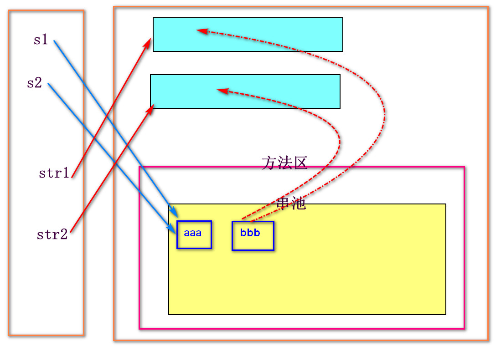

### 可变长字符串

-   StringBuffer：JDK1.0  线程安全，效率低
-   StringBuilder：JDK5.0   线程不安全，效率高

#### 使用

1.  必须通过构造创建
2.  对值的操作必须基于方法完成

```java
public static void main(String[] args) {
      /*  StringBuilder sb = new StringBuilder();
        //拼接A-Z
        for (char i = 65; i <=90 ; i++) {
            sb.append(i);
        }
        System.out.println(sb);*/


        StringBuilder sb1 = new StringBuilder("abc");
        StringBuilder sb2 = sb1;

        sb2.append("def");

        System.out.println(sb1);//abcdef
        System.out.println(sb2);//abcdef
        System.out.println(sb1 == sb2);//t

    }
```

### 常用方法

-   String引用名.方法名()

```java
public class StringTest4 {
    public static void main(String[] args) {
        String s = "hello";

        //1. char charAt(下标)：获取指定下标位置对应的字符（重要）
        System.out.println(s.charAt(1));//e
        //2. boolean contains("值")：判断字符串中是否包含指定元素（重要）
        System.out.println(s.contains("llo"));//t
        System.out.println(s.contains("elo"));//f
        //3. boolean endsWith("值")：判断字符串是否以指定内容结尾
        System.out.println(s.endsWith("lo"));//t
        //4. boolean startsWith("值")：判断字符串是否以指定内容开头
        System.out.println(s.startsWith("e"));//f
        System.out.println(s.startsWith("hello"));//t
        //5. boolean equals("值")：判断字符串是否与指定内容相同，区分大小写（重要）
        System.out.println(s.equals("Hello"));//f
        //6. boolean equalsIgnoreCase("值")：判断字符串是否与指定内容相同，不区分大小写
        System.out.println(s.equalsIgnoreCase("HELLO"));
        //7. byte[] getBytes()：将字符串转换为byte类型的数组
        byte[] bs = s.getBytes();
        for (int i = 0; i < bs.length; i++) {
            System.out.print((char) bs[i]+"  ");
        }
        System.out.println();
        //8. int indexOf("值")：获取指定内容在字符串中第一次出现的下标
        System.out.println(s.indexOf("l"));//2
        //9. int lastIndexOf("值")：获取指定内容在字符串中最后一次出现的下标
        System.out.println(s.lastIndexOf("l"));
        //10. boolean isEmpty()：判断字符串内容是否 ,不能判比null值
        System.out.println(s.isEmpty());//f
        String s2 = "";
        System.out.println(s2.isEmpty());//t
        //11. int length()：获取字符串长度（重要）
        System.out.println(s.length());
        //12. String replace("旧字符串","新字符串")：将旧字符串内容替换为新字符串内容（重要）
        System.out.println(s.replace("l","m"));//hemmo  替换所有匹配结果
        //13. String[] split("值")：根据指定内容对字符串进行分割，不保留分割元素（重要）
        String s3 = "a,b,c,d";
        String[] ss = s3.split(",");
        for (int i = 0; i < ss.length; i++) {
            System.out.print(ss[i]+"  ");//a b c d
        }
        System.out.println();
        //14. String subString(下标)：将字符串从指定下标位置截取至末尾（重要）
        String s4 = "abcdefg";
        System.out.println(s4.substring(2));//cdefg
        //15. String subString(开始下标,结束下标)：将字符串从开始下标截取至结束下标前一位（重要）
        System.out.println(s4.substring(1, 5));//bcde
        //16. char[] toCharArray()：将字符串转换称char类型的数组
        char[] cs = s.toCharArray();
        for (int i = 0; i < cs.length; i++) {
            System.out.print(cs[i]+"  ");
        }
        System.out.println();
        //17. String toLowerCase()：将字符串转全小写
        String s5 = "ABCD";
        System.out.println(s5.toLowerCase());//abcd
        //18. String toUpperCase()：将字符串转全大写
        System.out.println(s.toUpperCase());//HELLO
        //19. String trim()：去除字符串前后空格
        String s6 = "   a b c ";
        System.out.println(s6.trim());//a b c

    }
}
```

## 今日重点

1.  equals、hashCode、toString方法的重写
2.  什么是垃圾回收机制和零引用机制
3.  自动封箱和自动拆箱
4.  String转基本类型的语法
5.  整数缓冲区的概念
6.  什么是串池？
7.  String两种创建方式的区别？
8.  String、StringBuffer、StringBuilder的区别?

# Day15-List集合

## 集合的概念

是一个工具类，也是一个容器，作用为存储多个数据。通常用来替代数组

## 集合的特点

1.  只能存放引用类型
2.  所有的集合接口都来自于java.util包

## List的存储特点

-   有序、有下标、元素可以重复

> List、Set、Map都是接口

## 常用实现类

1.  ArrayList（常用）
    -   特点：JDK1.2	底层数组实现	查询快、增删慢	线程不安全，效率高
2.  LinkedList（一般不用）
    -   特点：JDK1.2	底层链表实现	增删快、查询慢	线程不安全，效率高
3.  Vector（压根不用）
    -   特点：JDK1.0	底层数组实现	都慢	线程安全，效率低

> 实际开发中，查询操作频率要远远多于增删改，所以查询效率较高的ArrayList更符合我们的日常开发需求

## 创建

-   建议使用多态

```java
List 集合名=new 实现类名();
如：
   List list=new ArrayList();
```

## 常用方法

-   集合名.方法名()

1.  boolean **add(元素)**：将元素添加至集合末尾
2.  void  add(下标，元素)：将元素添加至指定下标位置
3.  int **size()**：获取集合长度
4.  boolean  addAll(集合名)：将指定集合中的所有元素添加至集合末尾
5.  boolean  addAll(下标，集合名)：将指定集合中的所有元素添加至指定下标位置
6.  void clear()：清空集合元素
7.  boolean  **contains(元素)**：判断集合中是否包含指定元素
8.  boolean  containsAll(集合名)：判断当前集合中是否包含指定集合的所有元素
9.  元素  **get(下标)**：获取指定下标位置的元素
10. int  indexOf(元素)：获取指定元素第一次出现的下标
11. int  lastIndexOf(元素)：获取指定元素最后一次出现的下标
12. boolean isEmpty()：判断集合内容是否为空，不能判比null值
13. 元素  remove(下标)：删除指定下标位置的元素
    -   参数也可以为被删除的元素，假设元素也是整型，则优先认定参数为下标
14. boolean  removeAll(集合名)：在当前集合中删除指定集合的所有匹配元素
    -   会删除所有匹配的元素
15. 元素  set(下标，新元素)：将指定下标的元素替换为新元素
16. Object\[]  toArray()：将集合转换为等长的数组

## 遍历

### for+get()

```java
      List list = new ArrayList();
        list.add(55);
        list.add(77);
        list.add(98);
        list.add(63);
        list.add(63);

        for (int i = 0; i < list.size(); i++) {
            System.out.print(list.get(i)+"  ");
        }
```

### 迭代器

1.  通过集合的iterator()获取当前集合的迭代器
2.  迭代器对象.hasNext()：判断是否存在下一元素
3.  迭代器对象.next()：指针后移，获取下一元素

```java
      //获取迭代器
        Iterator it = list.iterator();
        while(it.hasNext()){//判断是否存在下一元素，存在，则进入循环获取，不存在则结束循环
            System.out.print(it.next()+"  ");
        }
```

-   不允许在遍历过程中进行增删操作
    -   原因是指针走向固定

### 外遍历forEach

```java
for(数据类型 元素名(随便起):集合名){
   //元素名就表示当前正在被遍历的元素
}
```

```java
for (Object o : list) {
    System.out.print(o+"  ");
}
```

-   JDK5.0
-   底层也是迭代器遍历，所以遍历过程中不允许进行增删操作

### 自遍历forEach

-   JDK8.0

```java
//匿名内部类
list.forEach(new Consumer() {
     @Override
     public void accept(Object o) {
         //o就代表当前元素
         System.out.print(o+"  ");
     }
});
```

```java
//lambda简化
list.forEach(o-> System.out.print(o+"  "));
```

-   不可增删元素

## 泛型

### 作用

约束集合存放的数据类型

```java
List<数据类型> 集合名=new 实现类名<数据类型>();
```

### 使用

1.  只能存放泛型声明的数据类型的数据
2.  如果要存放8大基本类型，则泛型类型需要声明为其包装类型
3.  前后泛型必须保持一致
4.  前边声明决定了存放的数据类型
5.  后边声明省略的话会导致语法不规范，可以通过<>做语法占位
    ```java
    List<Integer> list = new ArrayList<>();
    ```

## 今日重点

1.  集合的特点
2.  List的存储特点
3.  List的常用实现类及其特点
4.  List的遍历方式
5.  泛型的作用

# Day16-Set集合

## Collection

-   List和Set都是其子接口
-   所有集合都是通过Collection或者Map派生

### 特点

1.  内部存放着List和Set的共性方法
2.  没有直属实现类

## Set的存储特点

无序、无下标、元素不可重复

## 常用实现类

1.  HashSet（常用）
    -   特点：JDK1.2	底层哈希表(又名散列表：数组+链表)实现	线程不安全，效率高
2.  LinkedHashSet
    -   特点：JDK1.2	是HashSet的子类，底层哈希表实现	线程不安全，效率高
3.  TreeSet
    -   特点：JDK1.2	是SortedSet的实现类，底层红黑树实现	线程不安全，效率高

## 创建

-   建议使用多态

```java
Set<泛型> 集合名=new 实现类名<>();
```

## 常用方法

-   没有独有方法，所有方法都来自于父接口

## 遍历

1.  迭代器遍历
2.  外遍历forEach
3.  自遍历forEach

```java
public class Test {
    public static void main(String[] args) {
        Set<Integer> set = new HashSet<>();
        set.add(66);
        set.add(66);
        set.add(88);
        set.add(45);
        set.add(97);
        //迭代器遍历
        Iterator<Integer> it= set.iterator();//获取迭代器
        while(it.hasNext()){//判断是否存在下一元素
            System.out.print(it.next()+"  ");//97  66  88  45
        }
        System.out.println();
        //外遍历
        for (Integer i : set) {
            System.out.print(i+"  ");
        }
        System.out.println();
        //自遍历
        set.forEach(i-> System.out.print(i+"  "));

    }
}
```

## 哈希表的去重过程

1.  当往集合中存放元素时，会先调用元素的当往集合中存放元素时，会先调用元素的**hashCode()****hashCode()** 方法获取其哈希码值 方法获取其哈希码值
2.  通过**哈希码值%数组长度**得到存放下标
3.  如果下标位置未存有元素，则直接存放
4.  如果下标位置存有元素，则调用该元素的如果下标位置存有元素，则调用该元素的**equals()****equals()** 方法与该下标位置的所有元素进行值的比较 方法与该下标位置的所有元素进行值的比较
5.  都不相同，则继续链表存放
6.  有相同，则直接舍弃当前添加元素

> 底层数组长度为16

## 使用

1.  如果存放的是自定义类型，则需要在类中重写hashCode()和equals()方法才能保证HashSet和LinkedHashSet的去重
2.  LinkedHashSet能够保证元素存入和取出的顺序一致
3.  TreeSet可以对存入元素进行默认的升序排序
    -   TreeSet是在compare方法或compareTo方法返回值为0时去重
    -   如果集合中存放的为自定义类型，则必须自定义排序规则，否则运行出错
        1.  **实现Comparable接口，重写compareTo方法**
            -   方式：对谁排序，让谁实现。原理：让this当前对象和参数对象进行比较
            -   规则：
                1.  从小到大：this的值>o的值，返回正数。this的值\<o的值，返回负数
                2.  从大到小：this的值>o的值，返回负数。this的值\<o的值，返回正数
                3.  相等返回0
                ```java
                package com.bz.entity;

                public class Student implements Comparable<Student>{
                    private String name;
                    private int age;
                    private double score;

                    //省略getter、setter、构造

                    @Override
                    public int compareTo(Student o) {
                        //根据学生年龄从小到大排序
                        return this.age - o.age;
                    }
                }
                ```
        2.  **实现Comparator接口，重写compare方法**
            -   在集合创建处的小括号内传入比较器实现类对象即可
            ```java
            Set<Student> set = new TreeSet<>(new Comparator<Student>() {
                @Override
                public int compare(Student o1, Student o2) {
                    //根据学生年龄从大到小排序
                    return o2.getAge()- o1.getAge();
                }
            });
            ```
            ```java
            //lambda简化
            Set<Student> set = new TreeSet<>((o1,o2)->o2.getAge()- o1.getAge());
            ```
        > 更推荐使用Comparator比较器完成排序规则的定义，因为其项目结构更清晰，也不会违背类的单一职责
        > 另外，默认识别Comparable，但是当两种排序规则同时存在时，Comparator的优先级更高

## 今日重点

1.  Set的存储特点
2.  Set的常用实现类和特点
3.  Set的遍历方式
4.  哈希表的去重过程
5.  TreeSet对自定义类型进行排序的两种方式

# Day17-Map集合

## 存储特点

1.  以键（key）值（value）对的形式存储
2.  键：无序、无下标、元素不可重复
3.  值：无序、无下标、元素可以重复

## 常用实现类

1.  HashMap
    -   特点：JDK1.2	底层哈希表实现	线程不安全，效率高
2.  LinkedHashMap
    -   特点：JDK1.2	是HashMap的子类，底层哈希表实现	线程不安全，效率高
3.  TreeMap
    -   特点：JDK1.2	是SortedMap的实现类，底层红黑树实现	线程不安全，效率高
4.  Hashtable
    -   特点：JDK1.0	底层哈希表实现	线程安全，效率低
5.  Properties
    -   特点：JDK1.0	是Hashtable的子类，底层哈希表实现	线程安全，效率低

## 创建

-   建议使用多态

```java
Map<键的泛型,值的泛型> 集合名=new 实现类名<>();
```

```java
如：Map<Integer, String> map = new HashMap<>();
```

## 常用方法

1.  V  put(键,值)：将指定键值对添加至集合中
    -   如果键已经存在，则进行值的替换
2.  int size()：获取集合长度
3.  boolean containsKey(键)：判断是否包含指定键
4.  boolean containsValue(值)：判断是否包含指定值
5.  V  get(键)：根据指定键获取对应值
6.  V  remove(键)：根据键移除整个键值对
7.  V  replace(键，新值)：将指定键的值替换为新的值

## 遍历

1.  键遍历
    -   Set<键的泛型> keySet()：以Set集合的形式返回所有的键
    ```java
     Map<Integer, String> map = new HashMap<>();
            map.put(1, "星期1");
            map.put(2, "星期2");
            map.put(4, "星期4");
            map.put(3, "星期3");
            map.put(49, "星期49");

    //获取所有的键
    Set<Integer> set = map.keySet();
    //遍历所有键
    set.forEach(k->{
        System.out.println("键：" + k + ",值:" + map.get(k));
    });
    ```
2.  值遍历
    -   Collection<值的泛型> values()：以Collection集合的形式返回所有的值
    ```java
    //获取所有的值
    Collection<String> coll = map.values();
    //查看所有的值
    coll.forEach(v-> System.out.println(v));
    ```
3.  键值对遍历
    -   Set< Map.Entry<键的泛型，值的泛型> >  entrySet()：以Set集合的形式返回所有的键值对对象
        -   Entry：代表键值对对象，内部存放着key和value的值
        -   Set< Map.Entry<键的泛型，值的泛型> >相当于Set<键值对对象>
        -   Entry对象.getKey()：获取键
        -   Entry对象.getValue()：获取值
    ```java
    //键值对遍历
    Set<Map.Entry<Integer, String>> set = map.entrySet();
    //遍历键值对对象
    set.forEach(entry-> System.out.println("键："+entry.getKey()+",值："+entry.getValue()));

    ```
4.  自遍历forEach
    ```java
    //自遍历-匿名内部类
    map.forEach(new BiConsumer<Integer, String>() {
        @Override
        public void accept(Integer k, String v) {
            System.out.println("键："+k+",值："+v);
        }
    });
    //lambda简化
    map.forEach((k,v)->System.out.println("键："+k+",值："+v)); 
    ```

## 使用

1.  除去TreeMap外，其他Map集合如果键的类型为自定义类型，则必须重写其hashCode()和equals()方法才能保证去重
2.  LinkedHashMap能够保证元素存入和取出顺序一致
3.  TreeMap可以根据键对元素进行默认的升序排序
    -   如果键为自定义类型，则需要为其设定排序规则，两种方式与TreeSet一致
    -   不能根据null值进行排序
4.  Hashtable不能接收null值
5.  Properties键和值必须为String，通常用于配置文件
    -   创建时不能声明泛型
    -   不推荐使用多态
    -   存值：setProperty(键，值)
    -   取值：V  getProperty(键)

## 今日重点

1.  Map的存储特点
2.  Map的常用实现类及其特点
3.  Map的遍历方式
4.  Map的创建语法

# Day18-异常

## 异常的概念

程序中出现的不正常的情况

## 分类

Throwable：所有错误和异常的总父类

Error：错误

-   无法通过代码解决也无法提前避免的问题
-   通常由硬件设备、JVM、内存问题等导致

Exception：异常

-   可以提前避免或可以通过代码解决的程序问题
-   通常由代码导致
-   分类：
    -   RuntimeException：运行时异常，也称为未检查异常、未检异常等
        -   **编译不报错，但是运行出错**，可以提前处理也可以不处理
        -   java.lang.NullPointerException：空指针异常
        -   java.lang.ArrayIndexOutOfBoundsException：数组下标越界异常
        -   java.lang.StringIndexOutOfBoundsException：字符串下标越界
        -   java.lang.ClassCastException：类型转换异常
        -   java.lang.NumberFormatException：数据类型转换异常
        -   java.lang.ArithmeticException：数学运算异常
        -   .....
        -   **都来自于java.lang包**
    -   非RuntimeException：非运行时异常，也称为已检查异常、已检异常等
        -   **编译就会报错**，必须处理
        -   只要不是运行时异常，就一定是非运行时异常

## 异常的产生

1.  自动产生：当代码存在问题时，编译或者执行的过程中会自动产生异常，一旦发生，则程序终止
2.  手动产生：
    ```java
    throw new 异常类名();
    ```
    -   位置：方法内部
    -   使用：
        -   同一直属作用范围内，该语句下方不能存在其他有效语句
    -   原理：当程序执行到该语句时，会向虚拟机抛出一个异常对象，是程序执行强制终止

## 异常的处理

1.  上抛异常（消极处理）
    -   特点：异常发生在自己内部，但是自己并不解决问题，而是将问题**上抛至调用者**。问题并不会被根治，当异常最终被上抛至虚拟机时，仍然会导致程序终止
    -   语法：
        ```java
        访问修饰符 返回值类型 方法名(形参列表)throws 异常类名{
           
        }
        ```
    -   使用：
        1.  父类异常可以包含子类异常
        2.  当方法抛出父类异常之后，则调用者需要处理的也是父类异常
2.  try-catch块捕捉并处理异常（积极处理）
    ```java
    try{
       //有可能出现异常的代码
    }catch(有可能匹配的异常类型){
       //对处理方式
    }
    ```
    -   执行流程：当try中内容出现异常时，则开始与catch块捕捉的异常进行依次匹配，如果捕捉成功，则执行catch块内容，执行完程序直接继续向下。如果捕捉失败，则仍然触发异常，导致程序终止。

-   使用：
    1.  一个try-catch结构最多处理一个异常
        -   不会有异常的代码尽量不写进try中
            -   尽可能为每个有可能发生异常的代码单独书写try-catch结构
    2.  catch块可以存在多个，存在多个时匹配顺序为自上而下
    3.  一个异常最多匹配一个catch
        -   当存在多个catch块时，匹配至合适的catch之后，剩余catch将不再匹配
    4.  为了确保匹配成功，通常会在catch最下方尝试匹配异常最大父类Exception
        -   父类异常的匹配必须写在子类异常的下方
    5.  可以嵌套使用，只要逻辑完整，对嵌套层数不做要求
    6.  try、catch不能单独存在
    -   String   getMessage()：用来获取异常的详细信息
    -   通过异常对象调用
    -   void  printStackTrace()：打印异常对象的追栈(踪)信息
    -   异常类型、异常的详细信息、异常的实际触发位置
        -   通过异常对象调用

1.  finally块
    -   通常用于资源关闭
    -   无论try-catch的执行结果如何，finally一定会执行
    -   语法：
        ```java
        try{
           
        }catch(){
           
        }finally{
           //操作语句
        }
        ```
    -   使用：
        1.  必须写在最下方
        2.  try和finally可以单独结合，但是catch不能与finally单独结合
        3.  finally不能单独存在
        4.  当try、catch、finally中出现return语句冲突时，优先执行finally

## 自定义异常

1.  自定义运行时异常：继承RuntimeException
    > 异常属于工具类：com.xxx.util
    ```java
    /**
     * 运行时异常
     */
    public class MyRuntimeException extends RuntimeException {
        //无参
        public MyRuntimeException(){}
        //有参
        public MyRuntimeException(String message) {
            super(message);
        }

    }
    ```
    -   需要书写有参无参构造，通过有参构造的传参给详细信息属性赋值，方便后期调用getMessage()方法
2.  自定义非运行时异常：直接继承Exception
    -   内容书写与运行时一致
    ```java
    /**
     * 非运行时异常
     */
    public class MyException extends Exception{
        public MyException() {

        }

        public MyException(String message) {
            super(message);
        }
    }
    ```

## 今日重点

1.  异常的完整分类
2.  throw和throws的区别
    > 位置不同：
    -   throw写在方法内部
    -   throws写在方法声明处
    > 作用不同：
    -   throw是制造异常
    -   throws是处理异常
3.  try-catch-finally的使用
4.  final、finally、finalize的区别

# Day19-IO1

## IO的概念

将数据在程序和存储设备之间进行传输

I：input	输入

O：output	输出

## 流

相当于传输管道，作用为进行数据传输

## 流的分类

1.  从传输方向上看
    -   输入流：将外部数据输入到JVM
    -   输出流：将JVM数据输出至外部
2.  从传输单位上看
    -   字节流：以字节为单位进行数据传输，可以传输任意类型的文件，如文本、视频、图片、音频等
    -   字符流：以字符为单位进行数据传输，只能传输文本类型的文件，如.txt、.java、.html等
3.  从功能上看
    -   节点流：具有实际传输意义的流
    -   过滤流：没有实际传输功能，作用为给节点流增强传输能力或增加附加功能

## 字节流

1.  InputStream：字节输入流的总父类  抽象类
2.  OutputStream：字节输出流的总父类  抽象类

### 输出流

#### 常用方法

1.  void close()：关闭流链接，释放相关资源，每个流中都包含此方法
2.  void flush()：强制刷新缓冲区
3.  void write(int )：向外部写入一个字节
4.  void write(byte \[] )：向外部一次写入一个byte数组的数据

#### 字节输出节点流

-   FileOutputStream：文件字节输出节点流

1.  第一种创建方式
    ```java
    FileOutputStream  fos=new FileOutputStream("文件路径");
    ```
    -   绝对路径：以电脑磁盘为基点的完整文件路径
        ```java
        FileOutputStream fos = new FileOutputStream("D:\\test\\a.txt");
        FileOutputStream fos = new FileOutputStream("D:/test/a.txt");
        ```
    -   相对路径：以当前项目路径为基点的文件路径
        ```java
        FileOutputStream fos = new FileOutputStream("file\\b.txt");
        FileOutputStream fos = new FileOutputStream("file/b.txt");
        ```
    -   路径必须截止至文件
    -   如果文件不存在，则会在指定路径下自动创建
    -   如果文件夹不存在，则会报异常
    -   **默认进行数据覆盖**
2.  第二种创建方式
    ```java
    FileOutputStream  fos=new FileOutputStream("文件路径",true|false);
    ```
    -   true表示数据追加
    -   false表示数据覆盖，默认为false

```java
package com.bz.test;

import java.io.FileOutputStream;

public class Test {
    public static void main(String[] args) throws Exception{
        //创建字节输出节点流
        FileOutputStream fos = new FileOutputStream("file/c.txt",true);

        //一次写入一个字节
        fos.write(65);
        fos.write(66);
        fos.write(67);
        //写入一个byte数组的数据
        String s = "abcdefg";
        byte[] bs = s.getBytes();
        fos.write(bs);

        //关流
        fos.close();
        System.out.println("无异常");
    }
}

```

### 输入流

#### 常用方法

1.  int  read()：读取一个字节的数据并返回，如果读取到达末尾，返回-1
2.  int  read(byte\[] )：尝试读取数组长度的数据至数组中，返回实际读取个数，如果读取到达末尾，返回-1

#### 节点流

FileInputStream：文件字节输入节点流

-   创建方式与输出流的第一种创建方式一致
-   文件不存在，则报错

```java
package com.bz.test;

import java.io.FileInputStream;

public class Test2 {
    public static void main(String[] args) throws Exception{
        //创建一个字节输入流对象:外界数据-->JVM
        FileInputStream fis = new FileInputStream("file/c.txt");
        //一次读取一个字节
        /*System.out.println(fis.read());
        System.out.println(fis.read());
        System.out.println(fis.read());*/
        //利用read()读取文件所有内容
        while (true){
            int n = fis.read();
            if (n == -1) {
                break;
            }
            System.out.println((char) n);
        }
        //测试read(byte[])
        /*byte[] bs = new byte[50];
        int n = fis.read(bs);//尝试读取50个字节至bs中，返回本次实际读取的个数
        //查看本次读取内容
        System.out.println("本次实际读取个数："+n);
        for (byte b : bs) {
            System.out.print((char) b+"  ");
        }
        System.out.println();
        */
        //利用read(byte[])读取所有内容
        //创建一个用来接收的数组
        while(true){
            byte[] bs = new byte[5];
            //读取本次内容
            int n = fis.read(bs);
            if (n == -1) {
                break;//读取结束
            }
            //查看本次读取内容
            for (byte b : bs) {
                System.out.print((char) b+"  ");
            }
            System.out.println();
        }
        
        fis.close();//关流
        System.out.println("无异常");
    }
}

```

### 标准异常处理

```java
package com.bz.test;

import java.io.FileNotFoundException;
import java.io.FileOutputStream;
import java.io.IOException;

public class OutputStreamExceptionTest {
    public static void main(String[] args) {
        //创建字节输出流对象
        FileOutputStream fos =null;
        try {
            fos = new FileOutputStream("file/b.txt");
            //往文件中写入abcd
            fos.write(97);
            fos.write(98);
            fos.write(99);
            fos.write(100);

        } catch (FileNotFoundException e) {
            System.out.println("文件路径不正确");
        } catch (IOException e) {
            System.out.println("读写失败！");
        } catch (Exception e) {
            System.out.println("未知异常！");
            e.printStackTrace();
        }finally {
            if (fos != null) {//非空判断，预防空指针
                try {
                    fos.close();//关流
                } catch (IOException e) {
                    System.out.println("关流失败");
                }
            }
        }
    }
}

```

> 弊端：书写过于繁琐

#### 自动关流

-   JDK7.0
-   try-with-sourse

```java
try(
  //流对象的创建语句
){
   //其他有可能出现异常的代码
}catch(){//异常捕捉
   
}
```

-   原理：JDK7.0之后，所有的流对象都默认实现了AutoCloseable接口，该接口中提供了自动关流所需要的close()方法

```java
package com.bz.test;

import java.io.FileNotFoundException;
import java.io.FileOutputStream;
import java.io.IOException;

public class OutputStreamExceptionTest2 {
    public static void main(String[] args) {
        try (
                //创建字节输出流对象
                FileOutputStream fos = new FileOutputStream("file/b.txt");
                ){
            //往文件中写入abcd
            fos.write(97);
            fos.write(98);
            fos.write(99);
            fos.write(100);

        } catch (FileNotFoundException e) {
            System.out.println("文件路径不正确");
        } catch (IOException e) {
            System.out.println("读写失败！");
        } catch (Exception e) {
            System.out.println("未知异常！");
            e.printStackTrace();
        }
    }
}

```

## 文件复制

### 原理

先将文件1的数据读取至JVM中，再将读取的数据写入到文件2中。**(先读后写)**

```java
package com.bz.test;

import java.io.FileInputStream;
import java.io.FileNotFoundException;
import java.io.FileOutputStream;
import java.io.IOException;

public class FileCopyTest {
    public static void main(String[] args) {
        copy1();
        copy2();
    }

    /**
     * 一次复制一个字节
     * 将Java8新特性.pptx复制到Java8新特性2.pptxt中
     */
    public static void copy1(){
        try (
                //创建流对象：先创建输出流，再创建输入流
                FileOutputStream fos = new FileOutputStream("E:/Java8新特性2.pptx");//接收的文件路径
                FileInputStream fis = new FileInputStream("e:/Java8新特性.pptx")//被复制的文件路径
        ) {
            //先读
            while (true) {
                //接收本次读取内容
                int n = fis.read();
                if (n == -1) {
                    System.out.println("复制结束！");
                    break;
                }
                //后写
                fos.write(n);
            }

        } catch (FileNotFoundException e) {
            System.out.println("文件路径不正确");
        } catch (IOException e) {
            System.out.println("读或写失败");
        } catch (Exception e) {
            System.out.println("未知异常");
            e.printStackTrace();
        }
    }

    /**
     * 一次复制一个数组
     * 将Java8新特性.pptx复制到Java8新特性3.pptx中
     */
    public static void copy2(){
        try (
                //创建流对象：先创建输出流，再创建输入流
                FileOutputStream fos = new FileOutputStream("E:/Java8新特性3.pptx");//接收的文件路径
                FileInputStream fis = new FileInputStream("e:/Java8新特性.pptx")//被复制的文件路径
        ) {
            //先读
            while (true) {
                byte[] bs = new byte[1024];
                //尝试读取数组长度的数据至bs中
                int n = fis.read(bs);
                if (n == -1) {
                    System.out.println("复制结束！");
                    break;
                }
                //后写
                fos.write(bs);

            }

        } catch (FileNotFoundException e) {
            System.out.println("文件路径不正确");
        } catch (IOException e) {
            System.out.println("读或写失败");
        } catch (Exception e) {
            System.out.println("未知异常");
            e.printStackTrace();
        }
    }

}

```

## 缓冲过滤流

-   BufferedInputStream：输入流
-   BufferedOutputStream：输出流

### 原理

内置数据缓冲区，当进行读写操作时，数据会直接对接缓冲区，避免JVM频繁进行读取操作导致的效率降低

### 创建

基于节点流对象

```java
BufferedInputStream  bis=new BufferedInputStream(字节输入节点流对象);
BufferedOutputStream  bos=new BufferedOutputStream(字节输出节点流对象);
```

```java
/**
     * 一次复制一个数组+缓冲过滤流
     * 将Java8新特性.pptx复制到Java8新特性4.pptx中
     */
    public static void copy3(){
       // long l1 = System.nanoTime();
        try (
                //创建流对象：先创建输出流，再创建输入流
                FileOutputStream fos = new FileOutputStream("E:/Java8新特性4.pptx");//接收的文件路径
                FileInputStream fis = new FileInputStream("e:/Java8新特性.pptx");//被复制的文件路径
                //添加缓冲过滤流
                BufferedOutputStream bos = new BufferedOutputStream(fos);
                BufferedInputStream bis=new BufferedInputStream(fis)
        ) {
            //先读
            while (true) {
                byte[] bs = new byte[1024];
                //尝试读取数组长度的数据至bs中
                int n = bis.read(bs);
                if (n == -1) {
                    System.out.println("复制结束！");
                    break;
                }
                //后写
                bos.write(bs);

            }

        } catch (FileNotFoundException e) {
            System.out.println("文件路径不正确");
        } catch (IOException e) {
            System.out.println("读或写失败");
        } catch (Exception e) {
            System.out.println("未知异常");
            e.printStackTrace();
        }
      //  long l2 = System.nanoTime();
      //  System.out.println("数组+缓冲过滤流复制："+(l2-l1)/1E9);
    }
```

> 如果进行手动关流，只需要关闭外层过滤流即可，内层节点流会一并关闭

-   如果进行先写后读，为保证读取正常，需要再写入完成之后通过调用flush方法强制刷新缓冲区，以此使数据写入文件的时机提前
    ```java
    package com.bz.test;

    import java.io.*;

    public class BufferedTest {
        public static void main(String[] args) {
            try (
                    //创建流对象：先创建输出流，再创建输入流
                    FileOutputStream fos = new FileOutputStream("file/b.txt");
                    FileInputStream fis = new FileInputStream("file/b.txt");
                    //添加缓冲过滤流
                    BufferedOutputStream bos = new BufferedOutputStream(fos);
                    BufferedInputStream bis=new BufferedInputStream(fis)
            ) {
               //先往b.txt中写入内容
                bos.write(65);
                bos.write(66);
                bos.write(67);
                bos.write(68);

                //强制刷新缓冲区
                bos.flush();
               // bos.close();  也可以强刷缓冲区，关流之前进行，不推荐

                //再从b.txt中读取内容
                while (true) {
                    int n = bis.read();
                    if (n == -1) {
                        break;
                    }
                    System.out.println((char) n);
                }

            } catch (FileNotFoundException e) {
                System.out.println("文件路径不正确");
            } catch (IOException e) {
                System.out.println("读或写失败");
            } catch (Exception e) {
                System.out.println("未知异常");
                e.printStackTrace();
            }
        }
    }

    ```

## 对象过滤流

-   ObjectInputStream：对象字节输入过滤流
-   ObjectOutputStream：对象字节输出过滤流
-   附加功能1：支持读写八大基本类型
-   附加功能2：支持读写引用类型

### 读写基本类型

```java
oos.writeXxx(值)
ois.readXxx()
   注意：Xxx对应的是基本类型，首字母大写
```

-   如果先写后读，仍然需要刷新缓冲区
-   写入时乱码原因：当进行数据写入时，会根据魔数机制对其加密，就会出现乱码效果，在读取文件数据时，会自动对其进行解密。目的为保证数据流通的安全性

```java
package com.bz.ioday2.test;

import java.io.*;

public class Test {
    public static void main(String[] args) {
        try (
                //创建输出流
                FileOutputStream fos = new FileOutputStream("file/b.txt");
                //添加对象过滤流
                ObjectOutputStream oos = new ObjectOutputStream(fos);
                //创建输入流并添加对象过滤流
                ObjectInputStream ois=new ObjectInputStream(new FileInputStream("file/b.txt"))
        ) {
            //往目标文件写入一个6.6
            oos.writeDouble(6.6);
            System.out.println("写入成功！");

            //强刷缓冲区
            oos.flush();

            //读取目标文件的内容并输出
            System.out.println(ois.readDouble());


        } catch (FileNotFoundException e) {
            System.out.println("文件路径不正确");
        } catch (IOException e) {
            System.out.println("读或写失败");
        } catch (Exception e) {
            System.out.println("未知异常");
            e.printStackTrace();
        }
    }
}

```

### 读写引用类型

```java
oos.writeObject(Object )
Object  ois.readObject()
```

-   readObject()读取到达末尾，返回EOFException异常
-   writeObject()可以自动刷新缓冲区，所以先写后读时，无须手动强刷缓冲区

```java
package com.bz.ioday2.test;

import java.io.*;

public class Test2 {
    public static void main(String[] args) {
        try (
                //创建输出流
                FileOutputStream fos = new FileOutputStream("file/b.txt");
                //添加对象过滤流
                ObjectOutputStream oos = new ObjectOutputStream(fos);
                //创建输入流并添加对象过滤流
                ObjectInputStream ois=new ObjectInputStream(new FileInputStream("file/b.txt"))
        ) {
            //测试写入String类型
            oos.writeObject("太阳当空照");
            oos.writeObject("花儿对我笑");
            oos.writeObject("小鸟说早早早");
            oos.writeObject("你有病啊起这么早");

            System.out.println("写入成功！");

            //读取所有内容
            while (true) {
                try {
                    String s =(String) ois.readObject();//将类型强转为需要的数据类型
                    System.out.println(s);
                } catch (EOFException e) {//当匹配到该异常，则证明读取结束
                    break;//结束循环
                }

            }

        } catch (FileNotFoundException e) {
            System.out.println("文件路径不正确");
        } catch (IOException e) {
            System.out.println("读或写失败");
        } catch (Exception e) {
            System.out.println("未知异常");
            e.printStackTrace();
        }
    }
}
```

#### 读写自定义类型

-   自定义类型必须实现Serializable接口，意味着该类允许被序列化，否则IO流则无法操作和访问该类内容及对象
-   可以通过为属性添加transient修饰符的方式防止某些或某个属性参与序列化
-   如果属性类型为自定义类型，想要读写该属性，则对应类也必须进行序列化

```java
package com.bz.entity;

import java.io.Serializable;

public class Teacher implements Serializable {
    private String name;

   //省略getter、setter、构造、toString
}

public class Student implements Serializable {
    private String name;
    //标记该属性不参与序列化
    private transient int age;
    private double score;
    private Teacher tea;

   //省略getter、setter、构造、toString

}

```

```java
package com.bz.ioday2.test;

import com.bz.entity.Student;
import com.bz.entity.Teacher;

import java.io.*;

public class Test3 {
    public static void main(String[] args) {
        try (
                //创建输出流
                FileOutputStream fos = new FileOutputStream("file/b.txt");
                //添加对象过滤流
                ObjectOutputStream oos = new ObjectOutputStream(fos);
                //创建输入流并添加对象过滤流
                ObjectInputStream ois=new ObjectInputStream(new FileInputStream("file/b.txt"))
        ) {
            //创建一个学生对象
            Student stu = new Student("zhangsan", 20, 98.0,new Teacher("lisi"));
            //将对象写入文件
            oos.writeObject(stu);

            System.out.println("写入成功");
            //读取文件中的对象
            Student s = (Student) ois.readObject();
            System.out.println("读取的对象信息为:"+s);

        } catch (FileNotFoundException e) {
            System.out.println("文件路径不正确");
        } catch (IOException e) {
            System.out.println("读或写失败");
            e.printStackTrace();
        } catch (Exception e) {
            System.out.println("未知异常");
            e.printStackTrace();
        }
    }
}
```

> 序列化：将对象信息写入到IO流中的过程
> 反序列化：将从IO流中读取的信息组装回对象的过程

# Day20-IO2

## 字符流

-   操作char或者String类型的数据

### 输出流

-   抽象父类：Writer
-   节点流：FileWriter

#### 常用方法

1.  close()、flush()省略
2.  void write(int )：向外部写入一个字符
3.  void write(String )：向外部写入一个字符串

```java
package com.bz.test;

import java.io.FileNotFoundException;
import java.io.FileWriter;
import java.io.IOException;

public class FWTest {
    public static void main(String[] args) {
        try(
                //创建一个字符输出节点流
                FileWriter fw=new FileWriter("file/a.txt")
                ){
            //写入一个字符
            fw.write(65);
            fw.write(66);
            fw.write(67);
            //写入一个字符串
            fw.write("这是一个字符串");

            System.out.println("写入成功！");

        }catch (FileNotFoundException e) {
            System.out.println("文件路径不正确");
        } catch (IOException e) {
            System.out.println("读或写失败");
            e.printStackTrace();
        } catch (Exception e) {
            System.out.println("未知异常");
            e.printStackTrace();
        }
    }
}
```

### 输入流

-   抽象父类：Reader
-   节点流：FileReader

#### 常用方法

1.  close()省略
2.  int read()：读取一个字符并返回，读取到达末尾，返回-1

```java
package com.bz.test;

import java.io.FileNotFoundException;
import java.io.FileReader;
import java.io.FileWriter;
import java.io.IOException;

public class FRTest {
    public static void main(String[] args) {
        try (
                //创建一个字符输入节点流
                FileReader fr = new FileReader("file/a.txt")
        ) {
            //循环读取文件所有内容
            while (true) {
                int n = fr.read();
                if (n == -1) {//判断读取是否结束
                    break;
                }
                System.out.println((char) n);
            }

        } catch (FileNotFoundException e) {
            System.out.println("文件路径不正确");
        } catch (IOException e) {
            System.out.println("读或写失败");
            e.printStackTrace();
        } catch (Exception e) {
            System.out.println("未知异常");
            e.printStackTrace();
        }
    }
}

```

### 缓冲过滤流

-   BufferedReader：字符输入缓冲过滤流
-   PrintWriter：字符输出缓冲过滤流
    -   PrintWriter中的方法比BufferedWriter更实用

#### 创建

基于节点流，参考字节过滤流

#### PrintWriter

1.  void print(值)：向外部写入一个内容，默认不换行
2.  void  println(值)：向外部写入一个内容，默认换行
3.  void  println()：向外部写入一个空行

```java
package com.bz.test;

import java.io.*;

public class PWTest {
    public static void main(String[] args) {
        try(
                //创建一个字符输出节点流
                FileWriter fw=new FileWriter("file/a.txt");
                //添加缓冲过滤流
                PrintWriter pw=new PrintWriter(fw)
                ){
            pw.print("一二三四五");
            pw.print("上山打老虎");
            pw.println();
            pw.println("老虎没打着");
            pw.println("打着小松鼠");
            pw.println();
            pw.println("松鼠说：你有毛病吗");

            System.out.println("写入成功！");


        }catch (FileNotFoundException e) {
            System.out.println("文件路径不正确");
        } catch (IOException e) {
            System.out.println("读或写失败");
            e.printStackTrace();
        } catch (Exception e) {
            System.out.println("未知异常");
            e.printStackTrace();
        }
    }
}
```

#### BufferedReader

1.  String  readLine()：读取一行内容，以String形式并返回，读取到达末尾，返回null

```java
package com.bz.test;

import java.io.BufferedReader;
import java.io.FileNotFoundException;
import java.io.FileReader;
import java.io.IOException;

public class BRTest {
    public static void main(String[] args) {
        try (
                //创建一个字符输入节点流
                FileReader fr = new FileReader("file/a.txt");
                //添加缓冲过滤流
                BufferedReader br = new BufferedReader(fr)
        ) {

            //循环读取文件所有内容
            while (true) {
                String s = br.readLine();//接收本次读取内容
                if (s == null) {
                    //读取结束。跳出循环
                    break;
                }
                //输出查看本次读取结果
                System.out.println(s);
            }

        } catch (FileNotFoundException e) {
            System.out.println("文件路径不正确");
        } catch (IOException e) {
            System.out.println("读或写失败");
            e.printStackTrace();
        } catch (Exception e) {
            System.out.println("未知异常");
            e.printStackTrace();
        }
    }
}
```

## 桥转换流

-   InputStreamReader：输入流
-   OutputStreamWriter：输出流

### 作用

将字节流转换为字符流，并添加字符编码集

> **字符编码：**
> 编码：将原内容-->加密-->数字
> 解码：将数字-->解密-->原内容
> **字符编码集：**
> GBK：简体中文
> Big5：繁体中文
> ASC||：美国
> ISO-8859-1：西欧
> Unicode：
> ​	  UTF-8：行业标准    所占字节大小有内容大小决定，可以为1-3个字节
> ​      UTF-16：java默认的编码集，所有内容都默认占2个字节

### 创建

1.  先创建字节节点流对象，传入文件路径
2.  创建桥转换流(字符流)，传入字节流对象和编码集
3.  为桥转换流添加缓冲过滤流

```java
package com.bz.test;

import java.io.*;

public class ISR_OSW_Test {
    public static void main(String[] args) {
        try (
                //创建字节输出节点流
                FileOutputStream fos=new FileOutputStream("file/b.txt");
                //创建输出桥转换流
                OutputStreamWriter osw=new OutputStreamWriter(fos,"GBK");
                //添加字符输出缓冲过滤流
                PrintWriter pw=new PrintWriter(osw);
                //输入流
                FileInputStream fis=new FileInputStream("file/b.txt");
                InputStreamReader isr=new InputStreamReader(fis,"GBK");
                BufferedReader br=new BufferedReader(isr)

        ) {
            //先写
            pw.println("今天下雪了");

            pw.flush();

            //后读
            System.out.println(br.readLine());

        } catch (FileNotFoundException e) {
            System.out.println("文件路径不正确");
        } catch (IOException e) {
            System.out.println("读或写失败");
            e.printStackTrace();
        } catch (Exception e) {
            System.out.println("未知异常");
            e.printStackTrace();
        }
    }
}

```

-   **操作同一个文件时，读和写的编码集必须一致**

> 你怎么理解输出语句？
> 答：System是一个工具类，out是该类中的一个静态属性，属性类型为PrintStream标准输出流类型，println()和print()都是该流中的方法，作用为向控制台输出内容

## File类

### 作用

操作文件或者文件夹

> 与IO的区别：IO操作的是文件中的数据

### 常用方法

-   通过File类对象调用
    ```java
    File 对象名=new File("文件|文件夹的路径");
    ```

1.  boolean  createNewFile()：创建文件（不能创建文件夹）
2.  boolean mkdir()：创建文件夹
3.  boolean mkdirs()：创建多层文件夹
4.  boolean delete()：删除指定文件|文件夹
    -   文件夹存在下级内容，无法删除
5.  boolean exists()：判断指定文件|夹是否存在
6.  String  getAbsolutePath()：获取当前文件|夹的绝对路径
7.  String getName()：获取当前文件|夹的名字
8.  String getParent()：获取当前文件|夹的父目录
    -   以创建时的路径为获取基点
9.  boolean  isDirectory()：判断是否是文件夹
10. boolean  isFile()：判断是否是文件
11. long  length()：获取文件字节长度，文件夹则返回0
12. boolean  renameTo(拥有新路径和新名字的File对象)：将当前文件更名为参数对象所对应的内容
13. File\[]  listFiles()：获取当前文件夹下所有的File对象
    -   只能获取直属的文件|文件夹对象

## 今日重点-IO

1.  流的分类
2.  文件复制的源码(数组复制+缓冲过滤流)
3.  对象过滤流读写自定义类型的处理方式
4.  桥转换流的作用和创建
5.  File类和IO的区别
6.  PrintWriter和PrintStream中print()及println()的区别？
7.  字符缓冲过滤流和字节对象过滤流读写对象的区别？
    > 字符流读写的是对象最基本的属性信息，无法反序列化对象
    > 字节对象过滤流读写的是对象及类的完整信息，可以反序列化对象

# Day21-多线程

## 进程的概念

操作系统(OS)中并发执行(同时执行)的多个程序任务

## 进程的特点

-   **宏观并行，微观串行**
-   原理：在同一个时间段内，CPU会将该时间段划分为很多个时间片，时间片之间交替执行，并且一个时间片只能被一个进程拥有，当时间片的划分足够细小，交替频率足够快，就会形成宏观并行的假象，本质上各个程序之间仍然是串行

> 进程：正在进行中的程序

## 线程的概念

一个进程中并发执行的多个程序任务

## 线程的特点

-   **宏观并行，微观串行**
-   原理：一个时间片只能被一个进程拥有，一个进程在一个时间片内只能执行一个线程

> 线程是进程的基本组成部分

## 多线程

只存在多线程，不存在多进程

-   一个时间片内，只能有一个程序能称之为进程，其他程序都是“等待执行的程序”而已
-   任务一旦被创建。不管是否拥有时间片，都仍然称之为线程，所以开启了多个程序任务，进意味着存在了多个线程

## 线程的组成

1.  时间片
    -   OS调度分配
2.  数据
    -   栈：每个线程都有独立的栈空间（栈独立）
    -   堆：堆空间被所有线程共享（堆共享）
3.  代码
    -   书写逻辑

## 线程的创建

1.  继承Thread类，重写run方法
    ```java
    package com.bz.util;

    public class MyThread extends Thread{
        @Override
        public void run() {
            //输出0-99
            for (int i = 0; i < 100; i++) {
                System.out.println(i);
            }
        }
    }
    ```
    ```java
    package com.bz.test;

    import com.bz.util.MyThread;

    public class Test {
        public static void main(String[] args) {
            System.out.println("主函数开始");
            //创建线程对象
            Thread t1 = new MyThread();
            Thread t2 = new MyThread();

            //开启线程
            t1.start();
            t2.start();
           /* t1.run();
            t2.run();*/

            System.out.println("主函数结束");
        }
    }
    ```
2.  实现Runnable接口，重写run方法
    ```java
    package com.bz.util;

    /**
     * 线程任务
     */
    public class MyRunnable implements Runnable{
        @Override
        public void run() {
            for (int i = 100; i <200 ; i++) {
                System.out.println("runnable::::"+i);
            }
        }
    }
    ```
    ```java
    package com.bz.test;

    import com.bz.util.MyRunnable;
    import com.bz.util.MyThread;

    public class Test2 {
        public static void main(String[] args) {
            //创建线程对象，传入线程任务
            Thread t1 = new Thread(new MyRunnable());
            //直接创建线程对象
            Thread t2 = new MyThread();

            t1.start();
            t2.start();
        }
    }
    ```
    ```java
    package com.bz.test;

    public class Test3 {
        public static void main(String[] args) {
            //匿名内部类
            Thread t1=new Thread(new Runnable() {
                @Override
                public void run() {
                    for (int i = 0; i < 100; i++) {
                        System.out.println("t1:::"+i);
                    }
                }
            });
            //lambda表达式
            Thread t2=new Thread(()->{
                for (int i = 100; i < 200; i++) {
                    System.out.println("t2>"+i);
                }
            });
           
           t1.start();
           t2.start();
        }
    }

    ```

> 第一种创建方式：直接声明线程对象，在类的内部书写线程任务。违背了类的单一职责
> 第二钟创建方式：声明线程任务对象，在线程对象Thread中传入线程任务。更推荐

### 使用

1.  run()中存放着当前线程需要完成的任务内容
2.  调用run()并不是在开启线程，只是在进行单纯的对象方法调用。**调用start()方法才是开启线程**
3.  执行：当开启多个线程之后，所有线程会同时进行时间片的争夺，抢到时间片的线程才有资格执行自身内容，如果执行过程中丢失时间片，则暂停run()的执行，继续争夺时间片。直到自身内容执行结束，则退出争夺队列
4.  主函数也称为主线程，其必定是第一个拿到时间片的线程
5.  开启多个线程之后，JVM进程执行结束的标志将不再是主线程执行结束，而是所有线程执行结束

## 线程的状态

### 基础状态


-   JDK5.0之后，就绪状态和运行状态统称为了runnable状态

### 等待状态

1.  sleep()：使当前线程进入有限期休眠状态，在指定时间内，该线程会暂停时间片的争夺并释放自身资源，当休眠结束，会自动回到时间片的争夺队列
    ```java
    Thread.sleep(毫秒数);//1秒=1000毫秒
    ```
    ```java
    //匿名内部类
            Thread t1=new Thread(new Runnable() {
                @Override
                public void run() {
                    for (int i = 0; i < 100; i++) {
                        if (i == 5) {
                            //休眠3秒钟
                            try {
                                Thread.sleep(3000);
                            } catch (InterruptedException e) {
                                System.out.println("休眠异常");
                            }
                        }
                        System.out.println("t1:::"+i);
                    }
                }
            });
    ```
    -   sleep()需要处理异常，run()无法上抛异常，所以必须通过try-catch处理
2.  join()：暂停当前线程的执行，使当前线程进入无限期等待状态，优先执行调用者线程，当调用者线程死亡，当前线程才能回到就绪状态
    ```java
    线程对象.join();
    ```
    ```java
    Thread t2=new Thread(()->{
                try {
                    t1.join();//优先执行t1，t1执行完毕t2才能回到就绪状态
                } catch (InterruptedException e) {
                    System.out.println("join异常");
                }
                for (int i = 100; i < 200; i++) {
                    System.out.println("t2>"+i);
                }
            });
    ```
    -   join()需要处理异常，run()无法上抛异常，所以必须通过try-catch处理

## 线程池

### 概念

盛放和管理线程任务的容器

### 作用

将线程任务放入池中同一管理，当需要用到某个任务对象时，则直接从池中取出，任务执行结束该任务对象并不会销毁，而是回到池中等待下一次执行，直到线程池关闭。目的为避免线程任务被重复创建导致的空间浪费及效率降低

### 创建

1.  Executor：线程池总接口
2.  ExecutorService：线程池子接口，即将要使用的线程池
    -   submit(线程任务对象)：提交线程任务对象并执行
    -   shutdown()：关闭线程池
3.  Executors：线程池工具类，用于获取线程池对象，所有方法都是静态方法
    -   newCachedThreadPool()：获取一个不固定并发数量的线程池对象
    -   newFixedThreadPool(int 线程任务最大并发数量)：获取一个固定并发数量的线程池对象

```java
//固定最大并发数量为1的线程池对象
        ExecutorService es1 = Executors.newFixedThreadPool(1);
        //获取一个不固定并发数量的线程池对象
        ExecutorService es2 = Executors.newCachedThreadPool();
```

### Runnable

1.  run()：没有返回值，不能上抛异常
    > **固定并发数量的线程池：****固定并发数量的线程池：** 同时并发的数量固定，其他线程任务只能等正在并发执行的任务结束让位之后，才有可能进入池中执行。适用于对最大并发数量有固定要求的使用场景 同时并发的数量固定，其他线程任务只能等正在并发执行的任务结束让位之后，才有可能进入池中执行。适用于对最大并发数量有固定要求的使用场景
    > **不固定并发数量的线程池：****不固定并发数量的线程池：** 同时并发的数量不固定，所有提交到池中的线程任务都会同时参与并发。适用于对最大并发数量不做要求的场景 同时并发的数量不固定，所有提交到池中的线程任务都会同时参与并发。适用于对最大并发数量不做要求的场景

```java
package com.bz.test;

import com.bz.util.MyRunnable;

import java.util.concurrent.ExecutorService;
import java.util.concurrent.Executors;

public class Test6 {
    public static void main(String[] args) {
       //固定最大并发数量为2的线程池对象
        ExecutorService es1 = Executors.newFixedThreadPool(2);
        //获取一个不固定并发数量的线程池对象
       // ExecutorService es2 = Executors.newCachedThreadPool();

        //创建两个runnable线程任务对象
        Runnable r1=new Runnable() {
            @Override
            public void run() {
                for (int i = 0; i < 100; i++) {
                    System.out.println("r1:::"+i);
                }
            }
        };

        Runnable r2=new Runnable() {
            @Override
            public void run() {
                for (int i = 100; i < 200; i++) {
                    System.out.println("r2>>>>>"+i);
                }
            }
        };
        Runnable r3=new Runnable() {
            @Override
            public void run() {
                for (int i = 200; i < 300; i++) {
                    System.out.println("r3:"+i);
                }
            }
        };

        /*es2.submit(r1);
        es2.submit(r2);

        es2.shutdown();*/

        //提交至池中并执行
        es1.submit(r1);
        es1.submit(r2);
        es1.submit(r3);


        es1.shutdown();//关闭线程池
    }
}
```

### Callable

-   call()：相当于Runnable中的run()方法。有返回值，可以上抛异常（默认上抛Exception）
    ```java
    Callable<返回值类型> c1=new Callable<返回值类型>() {
                @Override
                public 返回值类型 call() throws Exception {
                    //操作语句
                   //return 语句;
                }
            };
    ```
    -   该线程任务执行结束之后返回的是一个Future对象
        -   Future：用来接收Callable任务执行的返回值
            -   Future对象.get()：获取返回值  （该方法需要处理异常）
    ```java
    package com.bz.test;

    import java.util.concurrent.Callable;
    import java.util.concurrent.ExecutorService;
    import java.util.concurrent.Executors;
    import java.util.concurrent.Future;

    public class Test7 {
        public static void main(String[] args) throws Exception{
           //创建线程池对象
            ExecutorService es = Executors.newCachedThreadPool();

            //创建Callable线程任务,计算1-100的和并返回
            Callable<Integer> c1=new Callable<Integer>() {
                @Override
                public Integer call() throws Exception {
                    int sum=0;//累加器
                    for (int i = 0; i <=100; i++) {
                        sum += i;
                    }
                    return sum;
                }
            };

          //提交到池中执行，并接收结果
            Future<Integer> f = es.submit(c1);
            //获取返回值
            System.out.println(f.get());

            es.shutdown();

        }
    }

    ```

## 线程安全问题

当多个线程同时访问同一个临界资源时，有可能破坏其原子操作，从而导致数据缺失

-   临界资源：被多个线程同时访问的对象
-   原子操作：当访问临界资源时，固定不可变的完整操作步骤称之为原子操作。原子操作不可缺失不可更改

### 互斥锁

-   所有对象默认拥有的锁
-   特点：**只能被一个线程拥有**，只有拿到时间片和锁标记的线程才有资格执行自身内容，其他线程只能等执行线程执行结束释放时间片和锁标记后，才有可能拥有锁标记
-   开启互斥锁，使线程同步：synchronized

### 同步方法

#### 原理

直接对临界资源中被访问的方法加锁

```java
访问修饰符 synchronized 返回值类型 方法名(形参列表){}
```

```java
package com.bz.util;

import java.util.ArrayList;
import java.util.List;

/**
 * 辅助操作集合属性的工具类
 */
public class MyList {
    private List<Integer> list = new ArrayList<>();

    //用来往集合属性中添加元素
    //同步方法
    public synchronized void insert(int n){//n=7
        list.add(n);
    }

    //用来查看集合属性的元素
    public void query(){
        System.out.println("当前集合长度为：" + list.size());
        for (int i = 0; i < list.size(); i++) {
            System.out.print(list.get(i)+"  ");
        }
    }

}

```

### 同步代码块

#### 原理

谁访问临界资源，谁对其加锁

```java
synchronized(临界资源对象){
   //被同步的操作
}
```

```java
package com.bz.test;

import com.bz.util.MyList;

public class MyListUtilTest {
    public static void main(String[] args)throws  Exception {
        //创建自定义工具类对象
        MyList m = new MyList();

        //线程1：往集合属性中添加1-5
        Thread t1=new Thread(()->{
            for (int i = 1; i <=5 ; i++) {
                synchronized (m) {//同步代码块
                    m.insert(i);
                }
            }
        });
        //线程2：往集合属性中添加6-10
        Thread t2=new Thread(()->{
            for (int i = 6; i <=10 ; i++) {
                synchronized (m) {//同步代码块
                    m.insert(i);
                }
            }
        });
        //开启线程
        t1.start();
        t2.start();
        //让线程t1和t2优先执行
        t1.join();
        t2.join();

        //主函数查看添加结果
        m.query();

    }
}

/*
* 张少良上厕所：
*   步骤：站上坑位-->脱裤子-->蹲下来-->上厕所-->擦屁股-->站起来-->穿裤子-->走人
* 梁天赐也要上厕所：
*
*
* 临界资源：坑位
* 线程：上厕所的人
* 原子操作：上厕所的完整步骤
*
* 解决方案1：直接给坑位加锁  需要争抢时间片+锁标记
* 解决方案2：给整个厕所的大门上锁   只需要争抢时间片
*
* */
```

### 区别

1.  同步方法：线程执行需要争抢时间片和锁标记
2.  同步代码块：线程执行只需要争抢时间片，拥有时间片的线程默认拥有锁标记（常用，效率更快）

## 线程安全的集合类

> 悲观锁：悲观的认为集合一定会出现线程安全问题，所以直接加锁
> 乐观锁：乐观的认为集合一定不会出现线程安全问题，所以不加锁，如果真的发生安全问题，则再通过算法解决问题

1.  ConcurrentHashMap：JDK5.0  java.util.concurrent
    -   原理：
        -   JDK8.0之前：分段锁(16段)
            -   为每个数组位都加锁，以悲观锁的形式保证线程安全
        -   JDK8.0之后：CAS算法
            -   采用无锁机制，以乐观锁的形式保证线程安全，更大程度提高效率
        > CAS：compare  and  swap（比较并交换）
        > 原有值(V)--预期值(E)--结果值(B)
        > 原理：只有当原有值和预期值的结果相同时，结果值才会存入内存，否则继续判断
        > int i=1;
        > i++;
        > V:1   E:1   B:2
2.  CopyOnWriteArrayList：JDK5.0  java.util.concurrent
    -   原理：乐观锁
        -   当对集合进行写操作时(增删改)，会先复制出来一个副本，在副本上完成写操作，如果没有异常，则将原有地址指向副本地址，若副本操作出现异常，则直接舍弃再次复制新副本重复操作。目的为保证原集合中一定不会因为写操作发生安全问题，确保了读操作的安全性。
    -   特点：舍弃写的效率，提高读的效率。适用于读操作远远多于写操作时
3.  CopyOnWriteArraySet：JDK5.0  java.util.concurrent
    
    -   原理：与CopyOnWriteArrayList一致，区别在于在进行写操作时会对元素进行去重

## 今日重点

1.  进程和线程的特点及原理
2.  线程两种创建方式
3.  线程的基础状态及发生时机
4.  Rannable和Callable的区别
5.  什么是线程安全问题?
6.  怎么解决线程安全问题？
7.  同步方法和同步代码块的区别
8.  线程安全的集合类都有哪些？

# Day22-反射和设计模式

## 反射

### 概念

是一种底层技术，通常用于底层框架的编写

### 类对象

-   类的对象：可以存在多个，是实例化的产物
-   类对象：是类加载的产物，通常只有一个。内部存放着该类的所有信息(属性、方法、构造、父类信息、接口信息等)

#### 获取-Class

1.  类名.class
2.  引用名.getClass()
3.  Class.forName("类的全限定名")

```java
public class Test {
    public static void main(String[] args) throws Exception {
        //1. 类名.class
        Class<Student> c1 = Student.class;
        //2. 引用名.getClass()
        Student stu = new Student();
        Class c2 = stu.getClass();
        //3. Class.forName("类的全限定名") 需要处理异常
        Class c3 = Class.forName("com.bz.entity.Student");
        
    }
}
```

#### 常用方法

-   通过类对象调用

1.  String  getName()：获取该类的全限定名
2.  类的对象  newInstance()：利用类对象中的无参构造构建该类的实例化对象
    -   如果类对象未声明泛型，则该方法返回的为Object，通常需要类型强转
3.  Constructor  getDeclaredConstructor(形参类型的类对象们)：获取指定形参列表的有参构造器对象
    -   Constructor对象.newInstance(实参列表)：通过有参构造器构建类的实例化对象

```java
package com.bz.test;

import com.bz.entity.Student;

import java.lang.reflect.Constructor;

public class Test {
    public static void main(String[] args) throws Exception {
        //1. 类名.class
        Class<Student> c1 = Student.class;

        System.out.println(c1.getName());
        //利用反射+无参构造构建学生对象
        Student stu = c1.newInstance();
        System.out.println(stu);

        //获取对应有参构造器对象
        Constructor<Student> con1= c1.getDeclaredConstructor(String.class,int.class,double.class);
        //利用有参构造器构建学生对象
        Student stu3 = con1.newInstance("wangwu", 30, 88.5);
        System.out.println(stu3);


        //3. Class.forName("类的全限定名") 需要处理异常
        Class c3 = Class.forName("com.bz.entity.Student");
        Student stu2 = (Student) c3.newInstance();
    }
}
```

### 优缺点

-   优点：
    1.  打破封装
    2.  提升代码的可扩展性
-   缺点：
    1.  打破封装
    2.  代码的可读性变差

### 反射重点

1.  类对象和类的对象的区别
2.  类对象的三种获取方式
3.  通过反射构建类的对象的两种方式

## 设计模式

### 概念

被广大程序员总结并认可的编码套路

### 单例模式

-   一个类只能被实例化出来一个对象

#### 饿汉式

-   无论是否需要，直接创建一个实例化对象

```java
package com.bz.entity;

/**
 * 单例-饿汉式
 */
public class ClassA {
    //static： 1. 方便getClassA()访问  2. 静态属性一个类只会创建一份
    //private：保留对该属性的主动权，防止外界任意访问该属性
    private static ClassA ca = new ClassA();

    //外界用来获取唯一实例的渠道
    //static:方便外界直接通过类名调用该方法
    public static ClassA getClassA(){
        return ca;
    }

    //将构造私有化，防止外界通过调用构造创建对象
    private ClassA(){

    }

}
```

-   有可能造成空间浪费

#### 懒汉式

-   只有当需要创建对象时，才会进行对象创建

```java
package com.bz.entity;

/**
 * 单例-懒汉式
 */
public class ClassB {
    //static： 1. 方便getClassA()访问
    //private：保留对该属性的主动权，防止外界任意访问该属性
    private static ClassB cb = null;

    //外界用来获取唯一实例的渠道
    //static:方便外界直接通过类名调用该方法
    //synchronized：确保线程安全
    public synchronized static ClassB getClassB(){
        if (cb == null) {//判断是否为第一次获取对象
            cb = new ClassB();
        }
        return cb;
    }

    //将构造私有化，防止外界通过调用构造创建对象
    private ClassB(){
        System.out.println("正在创建对象");
    }

}

```

-   缺点：线程效率太慢

#### 懒汉式-进阶版

-   在加锁的同时将同步方法切换成效率更高的同步代码块，并结合二次校验尽可能提高效率

```java
package com.bz.entity;

/**
 * 单例-懒汉式
 */
public class ClassB {
    //static： 1. 方便getClassB()访问
    //private：保留对该属性的主动权，防止外界任意访问该属性
    private static ClassB cb = null;

    //外界用来获取唯一实例的渠道
    //static:方便外界直接通过类名调用该方法
    //synchronized：确保线程安全
    public static ClassB getClassB(){
        if (cb == null) {//当判断为空时，才有可能出现线程安全问题，此时才需要加锁
            synchronized (ClassB.class) {//临界资源：当前类的类对象
                if (cb == null) {//判断是否为第一次获取对象  二次校验
                    cb = new ClassB();
                }
            }
        }
        return cb;
    }

    //将构造私有化，防止外界通过调用构造创建对象
    private ClassB(){
        System.out.println("正在创建对象");
    }

}
```

#### 懒汉式-懒加载

-   将获取自身实例的任务交给一个静态内部类完成

```java
package com.bz.entity;

/**
 * 单例-懒汉式
 */
public class ClassB {
    //static： 1. 方便getClassA()访问
    //private：保留对该属性的主动权，防止外界任意访问该属性
    private static ClassB cb = null;
    
    //静态内部类
    //private :防止外界访问
    private static class ClassBInner{
        //static:方便外界直接通过类名调用该方法
        //synchronized：确保线程安全
        public static ClassB get(){
            if (cb == null) {//当判断为空时，才有可能出现线程安全问题，此时才需要加锁
                synchronized (ClassB.class) {//临界资源：当前类的类对象
                    if (cb == null) {//判断是否为第一次获取对象  二次校验
                        cb = new ClassB();
                    }
                }
            }
            return cb;
        }
    }

    //外界用来获取唯一实例的渠道
    public static ClassB getClassB(){
        //调用静态内部类的方法获取结果并返回
        return ClassBInner.get();
    }

    //将构造私有化，防止外界通过调用构造创建对象
    private ClassB(){
        System.out.println("正在创建对象");
    }

}
```

### 工厂模式

-   特点：我们自身不再创建对象，而是交由工厂完成，需要对象时直接从工厂取出即可，常用于框架

#### 步骤

1.  书写实体类，用于创建对象
2.  书写.properties配置文件，存放工厂所需的类信息
3.  书写工厂类，利用Properties集合+反射构建类的对象
4.  测试

#### 第一步

```java
package com.bz.entity;

public class Student {
    private String name;
    private int age;
    private double score;

    @Override
    public String toString() {
        return "Student{" +
                "name='" + name + '\'' +
                ", age=" + age +
                ", score=" + score +
                '}';
    }

    public String getName() {
        return name;
    }

    public void setName(String name) {
        this.name = name;
    }

    public int getAge() {
        return age;
    }

    public void setAge(int age) {
        this.age = age;
    }

    public double getScore() {
        return score;
    }

    public void setScore(double score) {
        this.score = score;
    }

    public Student() {
    }

    public Student(String name, int age, double score) {
        this.name = name;
        this.age = age;
        this.score = score;
    }
}
```

#### 第二步

1.  右键项目新建后缀名为.properties的配置文件
2.  文件内容：**自定义键=值**（值：需要工厂管理的类的全限定名）
3.  注意：
    -   等号左右不加双引号
    -   语句最后不加分号
    -   不要存在多于空格
    -   键不能重复
    -   一行只能存在一条语句

```java
StudentClassName=com.bz.entity.Student
```

#### 第三步

```java
package com.bz.util;

import com.bz.entity.Student;

import java.io.FileInputStream;
import java.io.FileNotFoundException;
import java.io.IOException;
import java.util.Properties;

/**
 * 工厂类
 */
public class MyFactory {

    /**
     * 用来获取学生对象
     * @return
     */
    public static Student getStudent(){
        Student stu = null;

        try (
                //创建字节输入流
                FileInputStream fis=new FileInputStream("factory.properties")
                ) {
            //把配置文件的内容读取到Properties集合之中
            //创建Properties集合
            Properties p = new Properties();
            //load(输入流对象)：通过流将配置文件的内容读取到集合中
            p.load(fis);
            //从集合中取出学生类的全限定名
            String studentClassName = p.getProperty("StudentClassName");
            //利用全限定名获取Student的类对象
            Class c = Class.forName(studentClassName);
            //利用类对象通过反射构建学生对象并返回
            stu = (Student) c.newInstance();

        } catch (FileNotFoundException e) {
            System.out.println("文件路径不正确");
        } catch (IOException e) {
            System.out.println("文件读取失败！");
        } catch (Exception e) {
            System.out.println("未知异常！");
            e.printStackTrace();
        }

        return stu;
    }

}

```

#### 第五步

```java
package com.bz.test;

import com.bz.entity.Student;
import com.bz.util.MyFactory;

public class FactoryTest {
    public static void main(String[] args) {
        //利用工厂类获取学生对象
        Student stu1 = MyFactory.getStudent();
        Student stu2 = MyFactory.getStudent();

        System.out.println(stu1);
        System.out.println(stu2);
    }
}

```

> 一阶段笔记到此结束！

```java
String 引用名="值";   （常用）
```

```java
String 引用名=new String("值");
```


